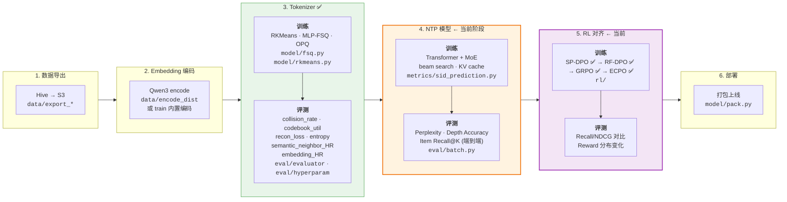
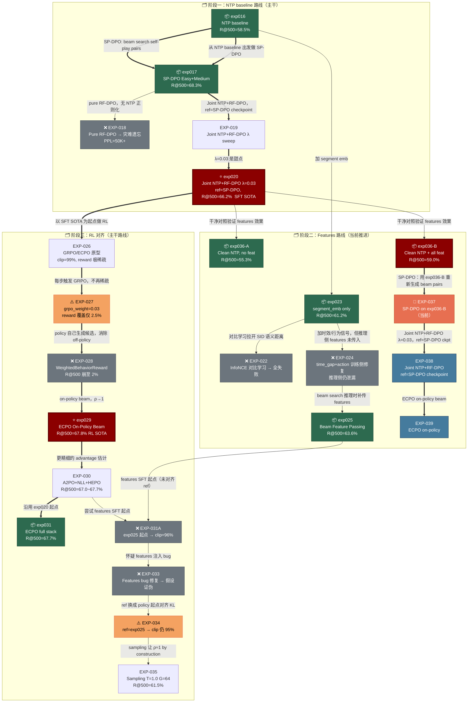

# gr_demo — Generative Recommendation Semantic ID Toolkit

基于 Qwen3 Embedding + Semantic ID 的生成式推荐系统研究工具包。
覆盖 Tokenizer 训练、NTP 模型、端到端评测、实验管理和论文 idea 追踪。

参考: [OneRec](https://arxiv.org/abs/2506.13695) / [OneRec-V2](https://arxiv.org/abs/2508.20900) / [GR4AD](https://arxiv.org/abs/2602.22732) / [OneMall](https://arxiv.org/abs/2601.21770)

## 当前阶段

```
Tokenizer ✅ → NTP ✅ → RL 对齐 ← (当前) → 部署
```

- **Tokenizer**: 4096×3 binary MLP-FSQ `[2]×12` 确认为赢家 (EXP-012, snHR=0.095, collision=0.89%)
- **Embedding**: 原始 Qwen3-0.6B 不做 fine-tune (EXP-007/009 证明 I2I contrastive 路线无效)
- **NTP**: S-tier (45.8M) 已完成，R@500=60%，scaling law 成立 (EXP-013/015)
- **RL 对齐**: SP-DPO → RF-DPO → GRPO → **ECPO (当前)** — 已完成全链路，含 GRPO→ECPO 稳定性复现
- **Ideas**: 63 个可实验想法已归档, 来源 39 篇工业论文

## 流程总览



所有命令通过 `python -m gr_demo <command>` 调用。

---

### Step 1. 数据导出 (Hive → S3)

PySpark 脚本，在 cloud notebook Notebook 里执行：

- 导出曝光内容 (文本 + 图片 URL) 到 S3
- 导出用户行为数据 (20+ 交互类型 → `action_bitmap`) 到 S3

对应文件: `data/export_content.py`, `data/export_behavior.py`

---

### Step 2. Embedding 编码

将文本/图片编码为 dense embedding 向量。两种方式：

```bash
# 方式 A: train 命令内置编码 (单机，自动缓存)
python -m gr_demo train --model qwen3-0.6b
# 首次运行会编码 → 缓存到 EFS，后续 --skip_embedding 跳过

# 方式 B: torchrun 分布式编码 (大数据量推荐)
torchrun --nproc_per_node=8 -m gr_demo.data.encode_distributed --model qwen3-0.6b
# 8 卡并行，增量缓存，OOM 自动减半 batch size
```

---

### Step 3. Tokenizer 训练 + 生成 Semantic ID

支持多种 tokenizer: RKMeans, MLP-FSQ, OPQ, RKMeans+FSQ。当前推荐 MLP-FSQ。

```bash
# 端到端: 编码 → 训练 Tokenizer → 生成 SID → 导出到 S3
python -m gr_demo train --model qwen3-0.6b

# 已有 embedding 缓存时跳过编码
python -m gr_demo train --model qwen3-0.6b --skip_embedding

# 自定义聚类参数
python -m gr_demo train --model qwen3-4b --num_clusters 2048 --niter 50 --nredo 5

# 只保留有曝光的 item 做训练
python -m gr_demo train --model qwen3-0.6b --behavior_path s3://bucket/behavior/2026-04-01

# 训练完顺便跑 intrinsic 评测
python -m gr_demo train --model qwen3-0.6b --skip_embedding --eval_intrinsic
```

---

### Step 4. NTP 模型训练 + 评测

Transformer + MoE 自回归模型，在 SID 序列上做 Next Token Prediction。

```bash
# 只跑 SID 预测 (NTP Transformer+MoE)
python -m gr_demo eval-all --only-sid

# 批量评测 + 生成对比报告
python -m gr_demo eval-all --models qwen3-0.6b

# 已有各模型结果，只生成对比报告
python -m gr_demo eval-all --compare-only
```

---

### Step 5. 评测工具

#### 5a. 单模型评测

```bash
# 全量评测 (intrinsic + behavior)
python -m gr_demo eval \
    --results_path s3://bucket/rkmeans/qwen3-0.6b/results.parquet \
    --model_path s3://bucket/rkmeans/qwen3-0.6b/rkmeans.pt \
    --behavior_path s3://bucket/behavior/2026-04-01

# 只看 intrinsic 指标 (不需要行为数据，快)
python -m gr_demo eval --results_path s3://... --model_path s3://... --intrinsic_only

# 只跑特定指标
python -m gr_demo eval --results_path s3://... --metrics reconstruction_loss entropy
```

#### 5b. 超参数搜索

```bash
# 网格搜索 num_clusters × niter × nredo
python -m gr_demo hyperparam --model qwen3-0.6b --skip_embedding

# 自定义搜索空间
python -m gr_demo hyperparam --model qwen3-0.6b --skip_embedding \
    --clusters 256 512 1024 2048 --niters 25 50 --nredos 1 3

# 断点续搜
python -m gr_demo hyperparam --model qwen3-0.6b --skip_embedding --append
```

#### 5c. Tokenizer Grid Search (多 GPU)

KMeans cluster × FSQ type × OPQ 全量搜索，自动缓存 KMeans、只跑关键 metrics。
换 embedding 模型时重跑即可确定最优 tokenizer 配置。

```bash
# 4 GPU 并行 (每个 cluster size 占一张卡)
python experiments/scripts/tokenizer_grid_search.py --gpus 0,1,2,3

# 单 GPU
python experiments/scripts/tokenizer_grid_search.py --gpus 0

# 跳过 OPQ 对照
python experiments/scripts/tokenizer_grid_search.py --gpus 0,1,2,3 --skip_opq
```

---

### Step 6. 打包部署

```bash
# 打包 model.tar.gz (Qwen 模型 + Tokenizer 权重)
python -m gr_demo pack \
    --rkmeans_s3_path s3://bucket/rkmeans/qwen3-0.6b/rkmeans.pt

# 打包 + 上传 model registry 模型仓库
python -m gr_demo pack \
    --rkmeans_s3_path s3://bucket/rkmeans/qwen3-0.6b/rkmeans.pt \
    --qwen_model Qwen/Qwen3-Embedding-0.6B \
    --upload
```

---

## 目录结构

```
gr_demo/
├── config.py              # 模型配置 (MODEL_CONFIGS) + Config dataclass
├── s3_utils.py            # S3 上传/下载/路径解析
├── cli.py                 # 统一 CLI 入口 (subcommand 分发)
├── run.py                 # 备用入口
├── data/
│   ├── export_content.py  # Hive → S3 内容导出 (PySpark)
│   ├── export_behavior.py # Hive → S3 行为导出 (PySpark)
│   ├── encode_distributed.py # torchrun 分布式编码
│   └── loaders.py         # 数据加载器
├── model/
│   ├── embedders.py       # Qwen3 Embedding 模型封装
│   ├── encode.py          # 编码流程
│   ├── train.py           # 端到端训练 CLI
│   ├── rkmeans.py         # RKMeans tokenizer (残差编码)
│   ├── fsq.py             # MLP-FSQ tokenizer (当前推荐)
│   ├── rkmeans_fsq.py     # RKMeans + FSQ 混合 tokenizer
│   ├── opq.py             # OPQ (Optimized Product Quantization)
│   ├── qformer.py         # QFormer (cross-attention 压缩)
│   ├── contrastive_finetune.py # I2I contrastive fine-tune (已关闭)
│   ├── semantic_ids.py    # SID 工具函数
│   └── pack.py            # 模型打包部署
├── eval/
│   ├── evaluator.py       # 单模型评测框架
│   ├── batch.py           # 批量评测 (eval-all)
│   ├── compare.py         # 模型对比报告
│   ├── behavior.py        # 行为指标评估
│   ├── hyperparam.py      # 超参搜索
│   └── wrapper.py         # 评测封装
├── metrics/
│   ├── base.py            # 指标基类
│   ├── sid_prediction.py  # NTP 模型 + MoE + 训练/评估 + beam search
│   ├── embedding_hitrate.py # Embedding hit rate (proxy metric)
│   ├── behavior.py        # 行为指标 (click/buy 共现)
│   ├── collision.py       # SID 碰撞率
│   ├── reconstruction.py  # 重建损失
│   ├── entropy.py         # 信息熵
│   ├── codebook.py        # Codebook 利用率
│   ├── cluster_balance.py # 聚类均衡度
│   ├── effective_dim.py   # 有效维度
│   ├── similarity.py      # 相似度指标
│   └── report.py          # 报告生成
├── experiments/
│   ├── log.md             # 实验日志 (EXP-001 ~ EXP-016)
│   ├── scripts/
│   │   ├── tokenizer_grid_search.py  # 多 GPU tokenizer 搜索 (通用, 可复用)
│   │   ├── exp-011.py     # EXP-011 codebook ablation
│   │   └── exp-011.sh     # EXP-011 shell 版
│   └── hyperparam/        # 超参搜索结果
├── rl/
│   ├── README.md          # RL 对齐 roadmap (SP-DPO → RF-DPO → GRPO → ECPO)
│   └── __init__.py
├── discussions/
│   ├── README.md          # 深度技术讨论索引
│   ├── 001-sp-dpo-vs-sft-vs-contrastive.md  # SP-DPO vs SFT vs 对比学习
│   └── 002-rf-dpo-grpo-ecpo-progression.md  # RL 对齐完整递进路径
├── ideas/
│   ├── README.md          # 索引 + 优先级总览 (62 ideas, 39 papers)
│   ├── tokenizer.md       # 量化方法 (9 ideas)
│   ├── embedding.md       # 表征增强 (5 ideas)
│   ├── architecture.md    # 模型架构 (17 ideas)
│   ├── training.md        # 训练目标 (13 ideas)
│   ├── rl-alignment.md    # RL 对齐 (9 ideas)
│   ├── inference.md       # 推理优化 (6 ideas)
│   └── scaling.md         # 扩展性 (3 ideas)
├── docs/
│   └── ARCHITECTURE.md    # 架构设计 (OneRec S/M/L 配置)
├── config/             # 敏感配置 (独立 git 仓库, .gitignore)
└── push.sh               # 一键推送脚本
```

## 实验全景图

> 详细记录见 [experiments/log.md](experiments/log.md)。

### 阶段一：Tokenizer (EXP-001 ~ 012)

| 实验 | 关键结论 | 胜者 |
|------|---------|------|
| EXP-001~006 | RKMeans 基线，超参搜索 (K, niter, nredo) | — |
| EXP-007 | I2I contrastive fine-tune **无效**；LoRA/全量 HR@50 均卡在 ~0.02 | 关闭 embedding fine-tune 路线 |
| EXP-008 | **MLP-FSQ h=64 胜出**；snHR=0.078，赢 OPQ 2.4× | MLP-FSQ |
| EXP-009 | QFormer tokenizer 未突破天花板；关闭 embedding 路线 | — |
| EXP-010 | NTP Probe 基线：单一 4027-dim vocab 跨 3 层，只跑 1 epoch → 极差 | — |
| EXP-011 | 等大 codebook 消融：4096×3 snHR=0.095 (+22% vs 1024×3) | 4096×3 |
| EXP-012 | **Tokenizer Grid Search**：4096×3 binary [2]×12 确认最优 | **snHR=0.095, collision=0.89%** |

**✅ Tokenizer 结论**：Qwen3-0.6B (冻结) + 4096×3 binary MLP-FSQ [2]×12 → 3-token SID。

---

### 阶段二：NTP 基础训练 (EXP-013 ~ 016)

| 实验 | 配置 | PPL | R@500 | 关键结论 |
|------|------|-----|-------|---------|
| EXP-013 | S-tier vs Probe | 29.6 → 70 | 60% / 37% | **S-tier 全面碾压**，PPL -58%，R@500 +1.6× |
| EXP-014 | ENTP-Loss 消融 | — | — | L0 token collision 导致退步，**关闭** |
| EXP-015 | Scaling Law sweep (1.7M~101M active) | 见下 | 见下 | **`L(N)=2.522+2055/N^0.456`**，M 档甜点 |
| EXP-016 | Data window sweep (7d/14d/31d/62d/90d) | 27.05 | 58.5% | **14d 最优**，Chinchilla 不适用 |

**✅ NTP 基础结论**：S-tier (17.5M active) + 14d 数据窗口 为最优配置。

---

### 阶段三：RL 对齐 Phase 1 — SP-DPO (EXP-017)

| 实验 | 方法 | PPL | R@10 | R@500 | 备注 |
|------|------|-----|------|-------|------|
| NTP baseline (EXP-016) | — | 27.05 | 9.9% | 58.5% | 数据起点 |
| EXP-017 | SP-DPO hard split | ~14.5 | 15.4% | 68.3% | +9.8pp vs baseline |

**SP-DPO 结论**：hard split preference pairs → R@500 68.3%，显著超越 NTP baseline。exp017-hard-medium 成为后续 ref model。

---

### 阶段四：RL 对齐 Phase 2 — RF-DPO (EXP-018 ~ 020)

| 实验 | 方法 | PPL | R@500 | 关键发现 |
|------|------|-----|-------|---------|
| EXP-018 | Pure DPO (easy/hard/prog) | 50K+ | 28.9% | **Catastrophic forgetting**，pure DPO 不可用 |
| EXP-019 | Joint NTP+DPO λ sweep | 14.4~57.7 | 66.4% | λ sweet spot: 0.01~0.03；防遗忘有效 |
| **EXP-020** | **Joint NTP+DPO, hard, λ=0.03** | **16.3** | **66.2%** | **✅ SFT SOTA baseline** |

**RF-DPO 结论**：
- Pure DPO = catastrophic forgetting（EXP-018 教训）
- Joint NTP+DPO + step-matched 防遗忘有效
- λ=0.03 sweet spot：PPL 16.3，R@500 66.2%
- **exp020-hard-lam03 成为后续所有 RL 实验的 SFT baseline**

---

### 阶段五：Side Features (EXP-021 ~ 025)

| 实验 | 方法 | PPL | R@500 | 关键发现 |
|------|------|-----|-------|---------|
| EXP-021 | Qwen3-4B vs 0.6B embedding | TBD | TBD | 待运行 |
| EXP-022 | In-Batch Contrastive (InfoNCE) | 27.89~29.66 | 56.3~59.2% | **全面失败**，干扰 NTP；关闭 |
| EXP-023 | Side Features: time_gap/action/segment | 25.16~28.78 | 55~61.2% | segment+有效；time_gap/action 存在**信息泄漏** |
| EXP-024 | Feature Shift（尝试修复泄漏）| ~26 | 52.9~59.8% | **失败**，shift 解决训练侧但 beam search 仍无特征 |
| **EXP-025** | **Beam Search Feature Passing** | **25.22** | **63.6%** | **✅ Features 新 SOTA**（+2.4pp vs segment baseline） |

**Features 结论**：
- 正确方案：不 shift 训练数据，修复 beam search incremental path 传入正确 features
- beam_passes: time_gap=真值 + action=carry-forward → R@500=63.6%
- **exp025-beam-passes 成为 features 路线的 SFT 起点**

---

### 实验谱系图



### 阶段六：RL 对齐 Phase 3/4 — GRPO + ECPO (EXP-026 ~ 035)

#### 详细结果表

| 实验 | 方法要点 | PPL | R@10 | R@500 | clip率 | 关键发现 |
|------|---------|-----|------|-------|-------|---------|
| EXP-026 | GRPO vs ECPO 对比，G=512 | — | — | ~19%* | 99% | **ECPO gnorm 稳定复现**（GRPO spike 158，ECPO 全程<0.5）|
| EXP-027 | grpo_weight=0.03, ratio=1.0 | — | — | — | 99% | 中途中断；BehaviorReward 覆盖率仅 2.5% |
| EXP-028 | WeightedBehaviorReward (quality×freshness) | 3791 | 0.7% | 2.0% | 99% | **严重退化**；off-policy ratio 爆炸 |
| **EXP-029** | **On-Policy Beam Search** | **14.1** | **13.0%** | **67.8%** | 92% | **✅ 首次超越 SFT SOTA**（+1.6pp）|
| EXP-030 | A2PO + NLL Reg + HEPO | 14.1~14.5 | 12.5~13.3% | 67.0~67.7% | — | 边际效益低；NLL reg 略有负效果 |
| EXP-031 | Features SFT 起点 (Config A/B) | 14.6/24.2 | 12.5/11.1% | **67.7%**/61.8% | 92%/96% | Config B 持平；Config A clip 率异常 |
| EXP-033 | Features bug 修复验证 | 24.62 | 10.3% | 61.0% | 96.2% | 假设证伪；真因：ref≠policy 起点 |
| EXP-034 | ref=exp025 对齐（中断） | — | — | — | 95% | clip 仍高；根因：NTP joint training softmax 漂移 |
| EXP-035 | Constrained Sampling T=1.0 G=64 | — | 10.2% | 61.5% | 94.8% | adv_std=0.595 改善；但 coverage=89% 信号弱 |

> *EXP-026 recall 为 inline eval（beam=500, 250 samples），不可与全量 baseline 直接比较。

#### GRPO/ECPO 工程踩坑记录

| 问题 | 根因 | 修复 |
|------|------|------|
| SIDTrie 为空，GRPO loss 永远 0 | `semantic_ids.npy` 是 `{item_id: sid}`，iterate `.keys()` 只得 item id | 改为 iterate `.values()` |
| reward std≈0 → advantage 爆炸 | 稀疏 reward，整组 reward 相同 | `std<1e-6` group skip + `adv.clamp(-5,5)` + `log_rho.clamp(-10,10)` |
| BehaviorReward 命中率 0.16% | 全 SID 精确匹配 | 加 prefix cascade fallback → L0 覆盖 24% |
| off-policy clip=99%，R@500 崩至 2% | ref model beam search → candidates 与 policy 分布偏离 | On-policy beam search (EXP-029) |
| clip 率 92~96% 居高不下 | NTP joint training 驱动 softmax 漂移；与 beam/sampling 无关 | 分析中；clip 是虚警，adv_std 才是核心指标 |

#### 核心 RL 认知更新（EXP-034/035 分析）

- **clip 率是虚警**：所有实验 clip=92~96%，与 beam/sampling/ref 对齐无关，是 NTP loss 驱动的 softmax 漂移副产品
- **真正的信号质量指标**：`adv_std`（advantage 标准差）和 `kl_mean`（KL 散度，新增）
- **sampling 优于 beam**：adv_std 从 ≈0 提升到 0.595，但 G=64 coverage 不足限制了效果
- **上游 SFT 是瓶颈**：exp025（features SFT）R@500=63.6% < exp020（66.2%），特征有效性未验证 → 暂停 RL，回到 NTP

#### 当前最优结果对比

| Checkpoint | 路线 | PPL | R@10 | R@500 | 状态 |
|-----------|------|-----|------|-------|------|
| exp020-hard-lam03 | NTP+RF-DPO | 16.3 | 14.1% | 66.2% | SFT SOTA |
| **exp029-ecpo-onpolicy** | NTP+RF-DPO+ECPO | **14.1** | 13.0% | **67.8%** | **✅ 当前 RL SOTA** |
| exp031-baseline | NTP+RF-DPO+ECPO+full stack | 14.6 | 12.5% | 67.7% | 与 exp029 持平 |
| exp025-beam-passes | features SFT (beam-passes) | 25.22 | 10.4% | 63.6% | features 起点（待替换） |

**当前进行中**：
- **EXP-036**（completed）：Config B(features) R@500=59.0% vs Config A(no feat) 55.3%，+3.7pp ✅ features 有效，exp036-full-features 作为新 RL 起点

---

**总结一句话**：`NTP(14d, S-tier) → RF-DPO(λ=0.03) → ECPO(on-policy, G=512)` 路线已验证，R@500 从 baseline 58.5% 提升至 **67.8%**（+9.3pp）。下一步：验证 features NTP（EXP-036），若有效则建立新 SFT 起点再继续 RL。

## NTP Scaling Law (EXP-015)

在相同数据上 sweep 7 个模型规模 (1.7M ~ 101M active params)，拟合 power law:

```
L̂(N) = 2.522 + 2055.1 / N^0.456
```

- **α = 0.456** — 接近 OneRec-V2 的 0.489，验证架构 scaling 效率
- **a = 2.522 (PPL≈12.5)** — irreducible loss floor，tokenizer + 用户行为随机性的天花板
- **M 档 (~55M active) 是性价比甜点** — 之后曲线趋于平坦


| Active Params | PPL | R@100 | R@500 |
|--------------|------|-------|-------|
| 1.7M | 235 | 11.8% | 23.6% |
| 5.1M | 70 | 24.9% | 45.6% |
| 17.5M (S) | 28 | 35.6% | 60.5% |
| 71.6M | 21 | 41.0% | 66.2% |
| 101.1M | **19** | **43.2%** | **65.8%** |

## Data Scaling Law (EXP-016)

固定 S (17.5M) 和 M+ (101M) 模型，sweep 数据窗口 {7d, 14d, 31d, 62d, 90d}：

**核心发现：Chinchilla data scaling 不适用于推荐序列。14d 是最优数据窗口，更多数据 loss 反升。**

| Days | Tokens | Users | S PPL | S Loss | M+ PPL | M+ Loss |
|------|--------|-------|-------|--------|--------|---------|
| 7 | 65M | 1.0M | 30.60 | 3.421 | 19.31 | 2.960 |
| **14** | **130M** | **1.7M** | **27.05** | **3.298** | **18.96** | **2.942** |
| 31 | 262M | 3.0M | 28.05 | 3.334 | 19.39 | 2.965 |
| 62 | 441M | 4.9M | 30.03 | 3.402 | 19.80 | 2.986 |
| 90 | 553M | 6.2M | 31.89 | 3.462 | — | — |


**为什么更多数据反而更差？**

1. **增加天数 ≠ 更长序列**：avg items/user 从 21 (7d) → 30 (62d) 几乎不变，真正增加的是用户数 (1M→4.9M)
2. **曝光窗口 3 天**：item pool 每 3 天完全刷新，30 天前的训练数据对应的 item pool 已不存在
3. **新增用户引入分布偏移**：老用户的行为 pattern 与当前 eval 分布不一致
4. **14d ≈ 4-5 个曝光周期**：刚好覆盖 item pool 多样性又不过多偏移

## RL 对齐路径 (EXP-017 ~ EXP-026)

四阶段渐进式对齐，每阶段在上一阶段 checkpoint 基础上继续训练：

```
NTP baseline (EXP-013)
    ↓
SP-DPO (EXP-017) — hard split preference, pairwise contrastive
    ↓
RF-DPO (EXP-018/020) — reward-filtered preference, λ-weighted
    ↓
GRPO (EXP-026) — group relative policy optimization, G=512 beam candidates
    ↓
ECPO (EXP-026) — early clipped GRPO, δ=0.1 sparse reward stabilizer
```

### GRPO (EXP-026)

基于 [OneMall](https://arxiv.org/abs/2601.21770)。

**原理**：对每个 context，用 ref model beam search 生成 G=512 candidates，组内 reward 归一化得到 advantage，PPO-style clipped surrogate loss：

```
A_i = (r_i - mean(r)) / std(r)
L = E[ min(ρ·A, clip(ρ, 1-ε, 1+ε)·A) ]    ρ = π_θ / π_ref
```

**Reward 系统** (`rl/reward.py`)：插件化设计，任意组合：

| 类 | 信号来源 | 说明 |
|----|---------|------|
| `BehaviorReward` | RF-DPO feedback shards | 行为信号打分，prefix cascade fallback (L0 覆盖 ~24%) |
| `FormatReward` | SIDTrie 合法性 | binary 1/0，sample_k=5 子采样降成本 |
| `ExternalReward` | 任意 callable | 外部奖励模型接口 |
| `BusinessReward` | 任意 callable | 时效性/作者加权等业务策略 |
| `CompositeReward` | 以上任意组合 | 加权求和，自动 namespace 至 `reward/*` metrics |

**数值稳定性修复**（EXP-026 实测）：
- 稀疏 reward → std≈0 → advantage 爆炸：加 `std < 1e-6` group skip + `adv.clamp(-5, 5)` + `log_rho.clamp(-10, 10)`
- prefix cascade 把 BehaviorReward 有效命中率从 0.16% 提升至 ~24%

### ECPO — Early Clipped GRPO (EXP-026)

基于 [OneRec](https://arxiv.org/abs/2506.13695)，GRPO 的稀疏 reward 稳定版。

**问题**：稀疏 reward 下，负 advantage 样本的 π_θ → 0，导致 ρ = π_θ/π_ref 爆炸，clipping 失效，梯度无界。

**ECPO 修复**：对负 advantage 样本，替换 denominator：

```
π'_ref = max( sg(π_θ) / (1+ε+δ),  π_ref )
ρ_eff  = π_θ / π'_ref              ← 上界被限制在 1+ε+δ
```

δ=0.1，从根源截断 ρ 的上界，无需依赖 gradient clipping。

**EXP-026 实验复现**（第一手数据，非论文搬运）：

| Step | GRPO gnorm | ECPO gnorm |
|------|-----------|-----------|
| 50   | 0.22 | **0.46** |
| 550  | 0.57 | **0.20** |
| 600  | **64.9** | **0.20** |
| 650  | **158.2** | **0.20** |
| 700  | 0.21 (自然回落) | **0.21** |

- GRPO step 600–650：gnorm 从 0.57 跳至 158，随 lr cosine decay → 0 后自然恢复
- ECPO 同等 reward 稀疏度下：全程 gnorm 0.19–0.46，零 spike
- ECPO grpo_loss 低 3 个数量级（step 50: GRPO=5.92 vs ECPO=0.011）

这精确复现了 OneRec 论文 ECPO 的核心动机：reward 越稀疏，ECPO 相对 GRPO 的稳定性优势越大。

---

## 关键结论

1. **Tokenizer 结构比 collision rate 更重要**: MLP-FSQ collision 10.7% 但 semantic_neighbor_HR 赢 OPQ (collision 0.06%) 2.4 倍
2. **KMeans cluster size 主导语义质量**: snHR 随 cluster 递增但边际递减 (1024→0.078, 4096→0.095, 8192→0.104)
3. **Binary FSQ 全面优于 multi-level**: collision 更低, Gini 更均匀, 尤其大 cluster 下优势显著
4. **Embedding fine-tune 路线已关闭**: I2I contrastive 信号不足以弥补 semantic→behavior embedding gap
5. **Model scaling law 成立**: NTP loss 遵循 `L(N) = 2.522 + 2055/N^0.456`，α 接近 OneRec-V2 (0.489)
6. **Data scaling law 不适用**: 推荐行为数据非 i.i.d.，最优训练窗口 ~14d，由曝光窗口周转速度决定
7. **当前瓶颈是 tokenizer**: M+ loss=2.94 已逼近 irreducible floor 2.52 (PPL 12.5)，加数据/模型均无法突破
8. **当前 pipeline**: Qwen3-0.6B (冻结) → 4096×3 binary MLP-FSQ `[2]×12` → 3-token SID → NTP 模型
9. **RL 对齐四阶段已完成**: SP-DPO → RF-DPO → GRPO → ECPO 全链路跑通，ECPO 稳定性优势实验复现，详见 [rl/README.md](rl/README.md)
10. **ECPO > GRPO 稳定性**: 稀疏 reward 下 GRPO gnorm spike 至 158；ECPO early clip (δ=0.1) 全程抑制在 <0.5，grpo_loss 低 3 个数量级

## 数据规模与分布

覆盖 2026-01-25 ~ 2026-03-31 (66 天) 的用户行为数据，分布极度长尾:

| 时间窗口 | 用户数 | 正向交互 | P50/user | P99/user | 有效 Tokens* |
|----------|-------|---------|----------|----------|-------------|
| 7d | 1.54M | 23.9M | 3 | 220 | ~61M |
| 14d | 2.51M | 53.1M | 3 | 331 | ~119M |
| 31d | 4.55M | 129.7M | 3 | 499 | ~238M |
| 62d | 7.29M | 261.8M | 3 | 669 | ~404M |
| 66d | 7.85M | 299.0M | 3 | 715 | ~445M |

> *有效 Tokens = 截断后 items × 3。NTP 训练每用户保留最近 170 items (max_seq_len=512)，
> 约 4% 重度用户被截断，但其交互占总量 ~50%。详见 [data/README.md](data/README.md)。

## NTP 模型架构

基于 OneRec-V2 Lazy Decoder-Only + MoE:

| 参数 | S 档 (当前) | M 档 (规划) |
|------|------------|------------|
| embed_dim | 256 | 512 |
| n_layers | 6 | 12 |
| n_heads | 8 | 8 |
| MoE experts | 8, top-2 | 16, top-2 |
| expert FFN | SwiGLU, dim=1024 | SwiGLU, dim=2048 |
| 总参数 | ~45.8M (激活 ~17M) | ~630M (激活 ~101M) |
| 预测 PPL | 28 | ~19 |
| SID | 3 tokens, 4096×3 binary `[2]×12` (36 bit) | 同左 |

详见 [docs/ARCHITECTURE.md](docs/ARCHITECTURE.md)。

## 支持的 Embedding 模型

| Key | HuggingFace Model | Dim | 多模态 | Batch Size (8xA100) |
|-----|-------------------|-----|--------|---------------------|
| `qwen3-vl-8b` | Qwen/Qwen3-VL-Embedding-8B | 4096 | Yes | 8 |
| `qwen3-vl-2b` | Qwen/Qwen3-VL-Embedding-2B | 2048 | Yes | 16 |
| `qwen3-8b` | Qwen/Qwen3-Embedding-8B | 4096 | No | 16 |
| `qwen3-4b` | Qwen/Qwen3-Embedding-4B | 2560 | No | 32 |
| `qwen3-0.6b` | Qwen/Qwen3-Embedding-0.6B | 1024 | No | 64 |

## 支持的 Tokenizer

| Key | 文件 | 说明 | 状态 |
|-----|------|------|------|
| MLP-FSQ | `model/fsq.py` | MLP 映射 + Finite Scalar Quantization | **当前推荐** (EXP-008 赢家) |
| RKMeans | `model/rkmeans.py` | 残差 K-Means 聚类 | 基线 |
| RKMeans+FSQ | `model/rkmeans_fsq.py` | 混合: 前层 KMeans + 末层 FSQ | 实验备选 |
| OPQ | `model/opq.py` | Optimized Product Quantization | 已验证劣于 MLP-FSQ |

## 环境依赖

```bash
pip install -r requirements.txt
```

核心依赖: `torch`, `transformers`, `faiss-gpu`, `boto3`, `s3fs`, `pandas`, `pyarrow`
