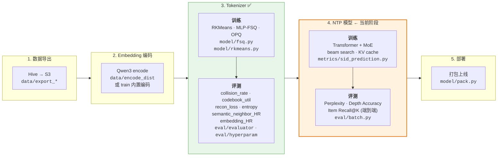

# gr_demo — Generative Recommendation Semantic ID Toolkit

基于 Qwen3 Embedding + Semantic ID 的生成式推荐系统研究工具包。
覆盖 Tokenizer 训练、NTP 模型、端到端评测、实验管理和论文 idea 追踪。

参考: [OneRec](https://arxiv.org/abs/2506.13695) / [OneRec-V2](https://arxiv.org/abs/2508.20900) / [GR4AD](https://arxiv.org/abs/2602.22732) / [OneMall](https://arxiv.org/abs/2601.21770)

## 当前阶段

```
Tokenizer 阶段 ✅ → NTP Baseline 阶段 ← (当前)
```

- **Tokenizer**: 4096×3 binary MLP-FSQ `[2]×12` 确认为赢家 (EXP-012, snHR=0.095, collision=0.89%)
- **Embedding**: 原始 Qwen3-0.6B 不做 fine-tune (EXP-007/009 证明 I2I contrastive 路线无效)
- **NTP**: Per-layer output head 已修复，准备重跑 baseline
- **Ideas**: 63 个可实验想法已归档, 来源 39 篇工业论文

## 流程总览



所有命令通过 `python -m gr_demo <command>` 调用。

---

### Step 1. 数据导出 (Hive → S3)

PySpark 脚本，在 cloud notebook Notebook 里执行：

- 导出曝光内容 (文本 + 图片 URL) 到 S3
- 导出用户行为数据 (20+ 交互类型 → `action_bitmap`) 到 S3

对应文件: `data/export_content.py`, `data/export_behavior.py`

---

### Step 2. Embedding 编码

将文本/图片编码为 dense embedding 向量。两种方式：

```bash
# 方式 A: train 命令内置编码 (单机，自动缓存)
python -m gr_demo train --model qwen3-0.6b
# 首次运行会编码 → 缓存到 EFS，后续 --skip_embedding 跳过

# 方式 B: torchrun 分布式编码 (大数据量推荐)
torchrun --nproc_per_node=8 -m gr_demo.data.encode_distributed --model qwen3-0.6b
# 8 卡并行，增量缓存，OOM 自动减半 batch size
```

---

### Step 3. Tokenizer 训练 + 生成 Semantic ID

支持多种 tokenizer: RKMeans, MLP-FSQ, OPQ, RKMeans+FSQ。当前推荐 MLP-FSQ。

```bash
# 端到端: 编码 → 训练 Tokenizer → 生成 SID → 导出到 S3
python -m gr_demo train --model qwen3-0.6b

# 已有 embedding 缓存时跳过编码
python -m gr_demo train --model qwen3-0.6b --skip_embedding

# 自定义聚类参数
python -m gr_demo train --model qwen3-4b --num_clusters 2048 --niter 50 --nredo 5

# 只保留有曝光的 item 做训练
python -m gr_demo train --model qwen3-0.6b --behavior_path s3://bucket/behavior/2026-04-01

# 训练完顺便跑 intrinsic 评测
python -m gr_demo train --model qwen3-0.6b --skip_embedding --eval_intrinsic
```

---

### Step 4. NTP 模型训练 + 评测

Transformer + MoE 自回归模型，在 SID 序列上做 Next Token Prediction。

```bash
# 只跑 SID 预测 (NTP Transformer+MoE)
python -m gr_demo eval-all --only-sid

# 批量评测 + 生成对比报告
python -m gr_demo eval-all --models qwen3-0.6b

# 已有各模型结果，只生成对比报告
python -m gr_demo eval-all --compare-only
```

---

### Step 5. 评测工具

#### 5a. 单模型评测

```bash
# 全量评测 (intrinsic + behavior)
python -m gr_demo eval \
    --results_path s3://bucket/rkmeans/qwen3-0.6b/results.parquet \
    --model_path s3://bucket/rkmeans/qwen3-0.6b/rkmeans.pt \
    --behavior_path s3://bucket/behavior/2026-04-01

# 只看 intrinsic 指标 (不需要行为数据，快)
python -m gr_demo eval --results_path s3://... --model_path s3://... --intrinsic_only

# 只跑特定指标
python -m gr_demo eval --results_path s3://... --metrics reconstruction_loss entropy
```

#### 5b. 超参数搜索

```bash
# 网格搜索 num_clusters × niter × nredo
python -m gr_demo hyperparam --model qwen3-0.6b --skip_embedding

# 自定义搜索空间
python -m gr_demo hyperparam --model qwen3-0.6b --skip_embedding \
    --clusters 256 512 1024 2048 --niters 25 50 --nredos 1 3

# 断点续搜
python -m gr_demo hyperparam --model qwen3-0.6b --skip_embedding --append
```

#### 5c. Tokenizer Grid Search (多 GPU)

KMeans cluster × FSQ type × OPQ 全量搜索，自动缓存 KMeans、只跑关键 metrics。
换 embedding 模型时重跑即可确定最优 tokenizer 配置。

```bash
# 4 GPU 并行 (每个 cluster size 占一张卡)
python experiments/scripts/tokenizer_grid_search.py --gpus 0,1,2,3

# 单 GPU
python experiments/scripts/tokenizer_grid_search.py --gpus 0

# 跳过 OPQ 对照
python experiments/scripts/tokenizer_grid_search.py --gpus 0,1,2,3 --skip_opq
```

---

### Step 6. 打包部署

```bash
# 打包 model.tar.gz (Qwen 模型 + Tokenizer 权重)
python -m gr_demo pack \
    --rkmeans_s3_path s3://bucket/rkmeans/qwen3-0.6b/rkmeans.pt

# 打包 + 上传 model registry 模型仓库
python -m gr_demo pack \
    --rkmeans_s3_path s3://bucket/rkmeans/qwen3-0.6b/rkmeans.pt \
    --qwen_model Qwen/Qwen3-Embedding-0.6B \
    --upload
```

---

## 目录结构

```
gr_demo/
├── config.py              # 模型配置 (MODEL_CONFIGS) + Config dataclass
├── s3_utils.py            # S3 上传/下载/路径解析
├── cli.py                 # 统一 CLI 入口 (subcommand 分发)
├── run.py                 # 备用入口
├── data/
│   ├── export_content.py  # Hive → S3 内容导出 (PySpark)
│   ├── export_behavior.py # Hive → S3 行为导出 (PySpark)
│   ├── encode_distributed.py # torchrun 分布式编码
│   └── loaders.py         # 数据加载器
├── model/
│   ├── embedders.py       # Qwen3 Embedding 模型封装
│   ├── encode.py          # 编码流程
│   ├── train.py           # 端到端训练 CLI
│   ├── rkmeans.py         # RKMeans tokenizer (残差编码)
│   ├── fsq.py             # MLP-FSQ tokenizer (当前推荐)
│   ├── rkmeans_fsq.py     # RKMeans + FSQ 混合 tokenizer
│   ├── opq.py             # OPQ (Optimized Product Quantization)
│   ├── qformer.py         # QFormer (cross-attention 压缩)
│   ├── contrastive_finetune.py # I2I contrastive fine-tune (已关闭)
│   ├── semantic_ids.py    # SID 工具函数
│   └── pack.py            # 模型打包部署
├── eval/
│   ├── evaluator.py       # 单模型评测框架
│   ├── batch.py           # 批量评测 (eval-all)
│   ├── compare.py         # 模型对比报告
│   ├── behavior.py        # 行为指标评估
│   ├── hyperparam.py      # 超参搜索
│   └── wrapper.py         # 评测封装
├── metrics/
│   ├── base.py            # 指标基类
│   ├── sid_prediction.py  # NTP 模型 + MoE + 训练/评估 + beam search
│   ├── embedding_hitrate.py # Embedding hit rate (proxy metric)
│   ├── behavior.py        # 行为指标 (click/buy 共现)
│   ├── collision.py       # SID 碰撞率
│   ├── reconstruction.py  # 重建损失
│   ├── entropy.py         # 信息熵
│   ├── codebook.py        # Codebook 利用率
│   ├── cluster_balance.py # 聚类均衡度
│   ├── effective_dim.py   # 有效维度
│   ├── similarity.py      # 相似度指标
│   └── report.py          # 报告生成
├── experiments/
│   ├── log.md             # 实验日志 (EXP-001 ~ EXP-012)
│   ├── scripts/
│   │   ├── tokenizer_grid_search.py  # 多 GPU tokenizer 搜索 (通用, 可复用)
│   │   ├── exp-011.py     # EXP-011 codebook ablation
│   │   └── exp-011.sh     # EXP-011 shell 版
│   └── hyperparam/        # 超参搜索结果
├── ideas/
│   ├── README.md          # 索引 + 优先级总览 (62 ideas, 39 papers)
│   ├── tokenizer.md       # 量化方法 (9 ideas)
│   ├── embedding.md       # 表征增强 (5 ideas)
│   ├── architecture.md    # 模型架构 (17 ideas)
│   ├── training.md        # 训练目标 (13 ideas)
│   ├── rl-alignment.md    # RL 对齐 (9 ideas)
│   ├── inference.md       # 推理优化 (6 ideas)
│   └── scaling.md         # 扩展性 (3 ideas)
├── docs/
│   └── ARCHITECTURE.md    # 架构设计 (OneRec S/M/L 配置)
├── config/             # 敏感配置 (独立 git 仓库, .gitignore)
└── push.sh               # 一键推送脚本
```

## 实验进展

| 实验 | 状态 | 结论 |
|------|------|------|
| EXP-001 ~ 006 | 完成 | RKMeans 基线 + 超参搜索 |
| EXP-007 | 完成 | I2I contrastive fine-tune 无效 (全量/LoRA, HR@50 卡在 ~0.02) |
| EXP-008 | 完成 | **MLP-FSQ h=64 胜出** (semantic_neighbor_HR=0.078, 赢 OPQ 2.4x) |
| EXP-009 | 完成 | QFormer tokenizer 未突破 0.02 天花板, 关闭 embedding fine-tune 路线 |
| EXP-010 | 完成 | NTP Baseline 效果极差 — 根因: 单一 4027-dim vocab 跨 3 层 + 仅 1 epoch |
| EXP-011 | 完成 | 等大 codebook 消融: 4096×3 snHR=0.095 (+22% vs 1024×3) |
| EXP-012 | 完成 | **Tokenizer Grid Search**: 4096×3 binary 确认为最优 (snHR=0.095, collision=0.89%) |

详见 [experiments/log.md](experiments/log.md)。

## 关键结论

1. **Tokenizer 结构比 collision rate 更重要**: MLP-FSQ collision 10.7% 但 semantic_neighbor_HR 赢 OPQ (collision 0.06%) 2.4 倍
2. **KMeans cluster size 主导语义质量**: snHR 随 cluster 递增但边际递减 (1024→0.078, 4096→0.095, 8192→0.104)
3. **Binary FSQ 全面优于 multi-level**: collision 更低, Gini 更均匀, 尤其大 cluster 下优势显著
4. **Embedding fine-tune 路线已关闭**: I2I contrastive 信号不足以弥补 semantic→behavior embedding gap
5. **当前 pipeline**: Qwen3-0.6B (冻结) → 4096×3 binary MLP-FSQ `[2]×12` → 3-token SID → NTP 模型

## NTP 模型架构 (S 档)

基于 OneRec-V2 Lazy Decoder-Only + MoE:

| 参数 | 值 |
|------|-----|
| embed_dim | 256 |
| n_layers | 6 (2 for probe) |
| n_heads | 8 |
| MoE experts | 8, top-2 |
| expert FFN | SwiGLU, dim=1024 |
| 总参数 | ~39.5M (激活 ~11M) |
| SID | 3 tokens, 4096×3 binary `[2]×12` (36 bit) |

详见 [docs/ARCHITECTURE.md](docs/ARCHITECTURE.md)。

## 支持的 Embedding 模型

| Key | HuggingFace Model | Dim | 多模态 | Batch Size (8xA100) |
|-----|-------------------|-----|--------|---------------------|
| `qwen3-vl-8b` | Qwen/Qwen3-VL-Embedding-8B | 4096 | Yes | 8 |
| `qwen3-vl-2b` | Qwen/Qwen3-VL-Embedding-2B | 2048 | Yes | 16 |
| `qwen3-8b` | Qwen/Qwen3-Embedding-8B | 4096 | No | 16 |
| `qwen3-4b` | Qwen/Qwen3-Embedding-4B | 2560 | No | 32 |
| `qwen3-0.6b` | Qwen/Qwen3-Embedding-0.6B | 1024 | No | 64 |

## 支持的 Tokenizer

| Key | 文件 | 说明 | 状态 |
|-----|------|------|------|
| MLP-FSQ | `model/fsq.py` | MLP 映射 + Finite Scalar Quantization | **当前推荐** (EXP-008 赢家) |
| RKMeans | `model/rkmeans.py` | 残差 K-Means 聚类 | 基线 |
| RKMeans+FSQ | `model/rkmeans_fsq.py` | 混合: 前层 KMeans + 末层 FSQ | 实验备选 |
| OPQ | `model/opq.py` | Optimized Product Quantization | 已验证劣于 MLP-FSQ |

## 环境依赖

```bash
pip install -r requirements.txt
```

核心依赖: `torch`, `transformers`, `faiss-gpu`, `boto3`, `s3fs`, `pandas`, `pyarrow`
