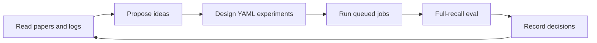
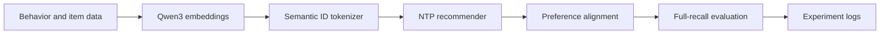

# nanoGenRec

[](LICENSE)
[](https://colab.research.google.com/github/yzq986/nanoGenRec/blob/master/public_benchmarks/nanogenrec_colab.ipynb)
[](requirements.txt)

[English](README.md) | [Chinese](README.zh.md)

[Paper PDF](paper/nanogenrec.pdf) | [arXiv source bundle](paper/nanogenrec-arxiv-source.tar.gz) | [Open Colab reproduction](https://colab.research.google.com/github/yzq986/nanoGenRec/blob/master/public_benchmarks/nanogenrec_colab.ipynb)

Agentic research framework for reproducible Generative Recommendation.

`nanoGenRec` is a from-scratch workspace for running recommendation research as a reproducible loop. It combines an agent-facing research protocol, YAML experiment orchestration, duplicate-run checks, queued execution, full-recall evaluation, paper notes, decision records, and durable experiment logs.

Generative Recommendation is the testbed and first landed application: the repo includes a Semantic-ID GR stack from Qwen3 item embeddings to tokenizer training, NTP recommendation, reward alignment, and full-recall evaluation on both production-grounded logs and public MovieLens data.

For users without private data, the repository includes a public MovieLens path that can run the strict framework loop on a free Colab T4 session: public ratings/metadata -> Qwen3 item embeddings -> residual KMeans Semantic IDs -> tiny NTP training -> GRPO-style reward alignment -> SID-constrained full-recall evaluation.
Fast CPU/hash-feature settings are kept as developer smoke tests. The recommended public run is the T4 notebook at [public_benchmarks/nanogenrec_colab.ipynb](public_benchmarks/nanogenrec_colab.ipynb).

The code is open-sourced after removing private data and deployment-specific details, while preserving the parts that matter for reproducing the modeling ideas, experiment automation, and engineering workflow.

## Core Contributions

| Contribution | What is released |
|--------------|------------------|
| Agentic research workflow | `research/` inbox/outbox protocol, paper notes, status tracking, decision records, and operating manual. |
| Experiment operating system | YAML configs, duplicate-run checks, runtime estimates, queue-friendly scripts, and committed experiment artifacts. |
| Evidence ledger | 51 experiment logs covering hypotheses, configs, successes, failures, invalid runs, and post-hoc analysis. |
| GR implementation | Semantic ID tokenizer, NTP recommender, preference/RL alignment, and SID-constrained full-recall evaluation. |
| Public proof path | MovieLens 1M Colab T4 run that executes Qwen embeddings -> SID -> NTP -> RL -> eval without private data. |

## Agentic Research Loop



The project treats recommendation research as an autonomous experimentation problem. `research/` defines an inbox/outbox protocol for human-agent collaboration, paper notes, status tracking, and decision records. `experiments/run_exp.py` expands YAML configs, checks duplicate baselines, runs variants, and can commit completed experiment artifacts. `experiments/queue.txt` and `run_config.sh` support asynchronous long-running jobs. This is the most important part of the repository: the GR results below are evidence that the research loop can drive a nontrivial multi-stage system.

## Quantitative Snapshot

| Dimension | Scale / Result | Source |
|-----------|----------------|--------|
| Agentic workflow | inbox/outbox protocol, paper-note memory, YAML config expansion, duplicate-run checks, queue-based execution, and decision records | [research/](research/program.md), [experiments/](experiments/README.md) |
| Experiment record | 51 logged experiments across tokenizer, NTP, side features, temporal encoding, and RL alignment | [experiments/logs/](experiments/logs/README.md) |
| Behavior data sweep | up to 7.85M users, 299.0M raw interactions, and ~445M effective SID tokens after sequence truncation | [EXP-016](experiments/logs/exp-016.md) |
| Scaling law sweep | 7 model sizes from 1.7M to 101.1M active parameters on 262M tokens | [EXP-015](experiments/logs/exp-015.md) |
| Tokenizer sweep | 14 Semantic ID variants over 0.6B/4B embeddings, 4096/8192 codebooks, and FSQ hidden sizes | [EXP-049](experiments/logs/exp-049.md) |
| Best NTP full eval | M-tier 4B SID model reaches R@500=70.4% and R@10=14.2% over ~49K eval items | [EXP-043](experiments/logs/ntp/README.md) |
| Best post-training recovery | on-policy ECPO recovers off-policy collapse from R@500=2.0% to 67.8% | [EXP-029](experiments/logs/exp-029.md) |
| Public reproducibility path | MovieLens 1M strict Qwen+RL Colab T4 run: 5,950 users, 3,532 items, R@500=72.2%, R@1000=86.0% | [public_benchmarks/results/ml-1m-qwen-rl-t4.md](public_benchmarks/results/ml-1m-qwen-rl-t4.md) |
| Colab GPU path | Free T4 notebook for Qwen3 embeddings, SID construction, NTP, public GRPO-style alignment, and full-recall eval | [Open in Colab](https://colab.research.google.com/github/yzq986/nanoGenRec/blob/master/public_benchmarks/nanogenrec_colab.ipynb) |

## Public Reproducibility Proof

The public MovieLens run is included to show that the released loop executes end to end without private data. It is not the main research claim or a tuned leaderboard submission. On MovieLens 1M, the strict Qwen -> SID -> NTP -> RL -> eval path runs on Colab T4 with 5,950 users, 3,532 items, 348,363 training examples, and 1,000 sampled eval users, reaching R@500=72.2% and R@1000=86.0%. Detailed simple-baseline numbers are kept in [public_benchmarks/results/ml-1m-baselines.md](public_benchmarks/results/ml-1m-baselines.md) for transparency.

## Highlights

- **Agentic research loop**: paper reading, idea proposal, experiment design, execution, evaluation, and decision logging are organized for human-agent collaboration.
- **Experiment operating system**: YAML configs, duplicate-run checks, queue-based long jobs, committed artifacts, and phase-level logs.
- **Production-grounded GR experiments**: modeling choices are evaluated against large-scale real behavior logs, not synthetic recommendation tasks.
- **End-to-end Semantic ID pipeline**: Qwen3 embeddings -> residual KMeans + FSQ -> 3-token item IDs.
- **Generative recommender**: Transformer + MoE next-token prediction over behavior sequences.
- **Alignment stack**: SP-DPO, RF-DPO, GRPO, and ECPO experiments on top of SFT checkpoints.
- **Full-recall evaluation**: beam search with SID constraints, Recall@K, tokenizer proxy metrics, and comparison reports.
- **Public T4 reproduction path**: MovieLens runs without private data, using Qwen3 item embeddings, residual KMeans SIDs, tiny NTP, GRPO-style alignment, and full-recall eval.
- **Developer smoke path**: hash-feature MovieLens runs without Qwen embeddings, Faiss, or GPUs for quick CI checks.

References: [OneRec](https://arxiv.org/abs/2506.13695), [OneRec-V2](https://arxiv.org/abs/2508.20900), [GR4AD](https://arxiv.org/abs/2602.22732), [OneMall](https://arxiv.org/abs/2601.21770).

## Technical Results

The core output of this repository is not a single model checkpoint. It is a set of measured training laws and post-training recipes for Semantic-ID-based generative recommendation.

### NTP Scaling Law


EXP-015 trained 7 model sizes from 1.7M to 101M active parameters and fit:

```text
L(N) = 2.522 + 2055.1 / N^0.456
```

The fitted exponent is close to OneRec-V2's reported 0.489, and full-recall R@500 rises from 23.6% to 66.2%. The useful operating region is around 50M-70M active parameters; beyond that, gains become increasingly data-limited.

### Data Scaling Law


EXP-016 shows that simply extending the behavior window is not monotonic. Recency, user breadth, and per-user sequence depth interact, so data scaling needs explicit control instead of "more days is always better".

### Post-Training Alignment


Post-training is where the project becomes more than SFT. EXP-028 showed an off-policy ECPO collapse at R@500=2.0%; EXP-029 fixed the candidate distribution and recovered to R@500=67.8%. On the feature-rich S-tier pipeline, ECPO after DPO improves R@500 from 62.1% to 65.7%.

## Result Index

| Area | Best Known Result | Representative Run | Details |
|------|-------------------|--------------------|---------|
| Semantic ID tokenizer | 4096x3 binary `[2]x12`, snHR=0.095, CR=0.89% | EXP-012 | [tokenizer logs](experiments/logs/tokenizer/README.md) |
| Embedding scale | 4B SID snHR=0.131; 0.6B SID snHR=0.092 | EXP-049 | [tokenizer logs](experiments/logs/tokenizer/README.md) |
| NTP recommender | M-tier bare R@500=70.2%; L-tier SFT R@500=64.1% | EXP-043 / EXP-047 | [NTP logs](experiments/logs/ntp/README.md) |
| RL alignment | ECPO R@500=65.7% on the S-tier pipeline | EXP-039B | [RL logs](experiments/logs/rl/README.md) |

Recent tokenizer work in EXP-049 confirmed `num_clusters=8192` as the stronger setting. h=64 and h=128 are effectively tied in the current sweep; the recommended SID caches are `exp049-0.6b-nc8192-h128` and `exp049-4b-nc8192-h128`.

## How It Works



The main CLI entry point is:

```bash
python run.py <command>
```

For distributed jobs:

```bash
PYTHONPATH=. torchrun --nproc_per_node=8 run.py <command>
```

## Quick Start

Install dependencies in the project environment, then run from the repository root:

```bash
python -m pip install -r requirements.txt
```

```bash
# Fast developer smoke path: no private data or GPU required
python run.py public-movielens \
    --dataset ml-latest-small \
    --output_dir public_benchmarks/runs/ml-latest-small-smoke \
    --epochs 1 \
    --max_users 200 \
    --clusters 16,16,16 \
    --embed_dim 32 \
    --layers 1 \
    --rl_steps 1 \
    --rl_batch_size 2 \
    --rl_group_size 4 \
    --eval_samples 20 \
    --beam_size 10

# Strict public Colab GPU path: open public_benchmarks/nanogenrec_colab.ipynb
# and select Runtime -> Change runtime type -> T4 GPU. This path uses
# --feature_source qwen and --rl_steps > 0.

# Train a tokenizer and produce Semantic IDs
python run.py train --model qwen3-0.6b

# Reuse an existing embedding cache
python run.py train --model qwen3-0.6b --skip_embedding

# Build NTP shards
python run.py preprocess-ntp \
    --sid_cache experiments/sid_cache/<sid-cache-name> \
    --output_dir experiments/ntp_data/<data-name> \
    --date_start 2026-03-18 \
    --date_end 2026-03-31

# Train an NTP model from a YAML config
python experiments/run_exp.py experiments/configs/exp-047.yaml --no-smoke --commit

# Run full evaluation
PYTHONPATH=. torchrun --nproc_per_node=8 run.py eval-ntp \
    --checkpoint experiments/ntp_checkpoints/<name> \
    --n_recall 1000
```

The standard training/evaluation environment used for experiments is `/home/dev/.conda/envs/gr`.

| Package | Version |
|---------|---------|
| Python | 3.12.13 |
| torch | 2.7.1+cu128 |
| CUDA driver | 12.8 |
| faiss-gpu | 1.14.1 |
| numpy | 2.4.4 |
| pandas | 3.0.2 |
| pyarrow | 24.0.0 |

## Experiment Workflow

New experiments should use `experiments/run_exp.py` with YAML configs. This keeps defaults explicit, avoids duplicate baselines, and makes results comparable across phases.

```bash
# Inspect shared defaults before writing a new config
sed -n '1,220p' experiments/configs/_base.yaml

# Check for similar historical runs
python experiments/run_exp.py experiments/configs/exp-NNN.yaml --check

# Run all variants
python experiments/run_exp.py experiments/configs/exp-NNN.yaml --no-smoke --commit

# Resume or run one variant
python experiments/run_exp.py experiments/configs/exp-NNN.yaml --only expNNN-a --no-smoke
```

Queue long-running experiments through the shared wrapper:

```bash
echo "run_config.sh experiments/configs/exp-NNN.yaml  /tmp/expNNN.log  exp-NNN complete!" >> experiments/queue.txt
```

Inline eval during `train-ntp` is a health check only. Reported numbers should come from full eval with `run.py eval-ntp --n_recall 1000`.

## Repository Layout

| Path | Purpose |
|------|---------|
| [data/](data/README.md) | Data export, loading, embedding synchronization, and distributed encoding. |
| [tokenizer/](tokenizer/README.md) | Semantic ID tokenizers and SID preprocessing. |
| [ntp/](ntp/README.md) | Generative recommendation model, preprocessing, training, and evaluation. |
| [rl/](rl/README.md) | Preference and RL alignment methods. |
| [eval/](eval/README.md) | Evaluation wrappers, behavior metrics, full-recall reports, and comparisons. |
| [metrics/](metrics/README.md) | Intrinsic and behavior-aware tokenizer/embedding metrics. |
| [model/](model/README.md) | Embedding wrappers, model packaging, and compatibility shims. |
| [viz/](viz/README.md) | Post-training visualization tools. |
| [experiments/](experiments/README.md) | Configs, orchestration, queues, checkpoints, and result artifacts. |
| [experiments/logs/](experiments/logs/README.md) | Phase-level experiment records and SOTA summaries. |
| [docs/](docs/README.md) | Architecture notes, engineering logs, and durable documentation. |
| [ideas/](ideas/README.md) | Research backlog organized by improvement dimension. |

## License

The code is released under the [MIT License](LICENSE).

## Documentation

| Topic | English | Chinese |
|------|---------|---------|
| Documentation index | [docs/README.md](docs/README.md) | [docs/README.zh.md](docs/README.zh.md) |
| Architecture | [docs/ARCHITECTURE.md](docs/ARCHITECTURE.md) | [docs/ARCHITECTURE.zh.md](docs/ARCHITECTURE.zh.md) |
| Engineering log | [docs/engineering/README.md](docs/engineering/README.md) | [docs/engineering/README.zh.md](docs/engineering/README.zh.md) |
| Experiment logs | [experiments/logs/README.md](experiments/logs/README.md) | - |

## Reporting Results

When an experiment completes, update the three places that serve different readers:

| File | Reader | Content |
|------|--------|---------|
| `experiments/logs/<phase>/exp-NNN.md` | Experiment reviewer | Background, hypothesis, design, results, analysis, next steps. |
| `experiments/logs/<phase>/README.md` | Research planner | Current best table, completed runs, and next experiments. |
| `README.md` | New visitor | Only headline results and representative links. |

## Notes

- The repository root is added directly to `PYTHONPATH`; imports do not use a package prefix.
- Use `python run.py <command>`, not `python -m <package>`.
- For standalone shell scripts, export `PYTHONPATH` to the repository root before running project modules.

## Citation

If you use nanoGenRec, please cite the repository and technical report. Citation
metadata is also available in [CITATION.cff](CITATION.cff).

```bibtex
@misc{ye2026nanogenrec,
  title        = {nanoGenRec: An Agentic Research Framework for Landing Semantic-ID Generative Recommendation},
  author       = {Ziqing Ye},
  year         = {2026},
  url          = {https://github.com/yzq986/nanoGenRec},
  note         = {Open-source repository and technical report}
}
```
