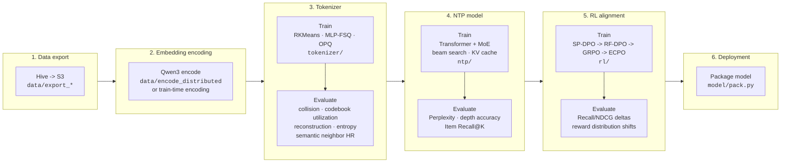

# gr_demo — Generative Recommendation Semantic ID Toolkit

[English](README.md) | [中文](README.zh.md)

Research toolkit for generative recommendation with Qwen3 Embeddings and Semantic IDs. The project covers tokenizer training, next-token-prediction recommendation models, RL alignment, end-to-end evaluation, experiment tracking, and research idea management.

References: [OneRec](https://arxiv.org/abs/2506.13695) / [OneRec-V2](https://arxiv.org/abs/2508.20900) / [GR4AD](https://arxiv.org/abs/2602.22732) / [OneMall](https://arxiv.org/abs/2601.21770)

## Current Stage

```text
Tokenizer done -> NTP done -> RL alignment current -> Deployment
```

| Stage | Current Best | Experiment | Docs |
|------|--------------|------------|------|
| **Tokenizer** | 4096x3 binary `[2]x12`, snHR=0.095, CR=0.89% | EXP-012 | [tokenizer logs](experiments/logs/tokenizer/README.md) |
| **Embedding** | 0.6B: snHR=0.092, CR=0.42%; **4B: snHR=0.131**, CR=1.28% at nc=8192 | EXP-049 | [tokenizer logs](experiments/logs/tokenizer/README.md) |
| **NTP** | M-tier bare R@500=**70.2%**; L-tier SFT R@500=64.1% | EXP-043/047 | [NTP logs](experiments/logs/ntp/README.md) |
| **RL Alignment** | ECPO R@500=**65.7%** on S-tier pipeline; L-tier pending | EXP-039B | [RL logs](experiments/logs/rl/README.md) |

**EXP-049 is complete**: nc=8192 is decisive (Gini_d2 0.35 -> 0.24), h=64/128 are equivalent, recommended configs are exp049-{0.6b,4b}-nc8192-h128.

**EXP-050 is queued**: M-tier NTP with 0.6B/4B SID, output-gate/CADET, and bare+RoPE ablations across 6 variants.

## Pipeline



Use `python run.py <command>` as the CLI entry point.

## Quick Start

```bash
# Train tokenizer and produce Semantic IDs
python run.py train --model qwen3-0.6b

# Skip embedding if a cache already exists
python run.py train --model qwen3-0.6b --skip_embedding

# Distributed embedding for large data
PYTHONPATH=. torchrun --nproc_per_node=8 data/encode_distributed.py --model qwen3-0.6b

# Evaluate a trained NTP checkpoint
PYTHONPATH=. torchrun --nproc_per_node=8 run.py eval-ntp \
    --checkpoint experiments/ntp_checkpoints/<name> \
    --n_recall 1000
```

## Experiment Workflow

New experiments use `experiments/run_exp.py` plus YAML configs.

```bash
# Inspect defaults before writing an experiment config
sed -n '1,220p' experiments/configs/_base.yaml

# Check for similar historical runs before training
python experiments/run_exp.py experiments/configs/exp-NNN.yaml --check

# Run all variants
python experiments/run_exp.py experiments/configs/exp-NNN.yaml --no-smoke --commit

# Resume or run one variant
python experiments/run_exp.py experiments/configs/exp-NNN.yaml --only expNNN-a --no-smoke
```

Queue a background experiment through the shared queue wrapper:

```bash
echo "run_config.sh experiments/configs/exp-NNN.yaml  /tmp/expNNN.log  exp-NNN complete!" >> experiments/queue.txt
```

## Repository Map

| Path | Purpose |
|------|---------|
| `data/` | Hive/S3 export, embedding synchronization, distributed encoding, loaders |
| `tokenizer/` | Semantic ID tokenizers: RKMeans, FSQ, RKMeans+FSQ, SID preprocessing |
| `ntp/` | NTP model, features, preprocessing, training, evaluation |
| `rl/` | RL alignment: SP-DPO, RF-DPO, GRPO, ECPO, rewards, preference data |
| `eval/` | Batch evaluation, behavior metrics, comparison reports, wrappers |
| `metrics/` | Intrinsic metrics, reconstruction, entropy, collision, codebook balance |
| `experiments/` | YAML configs, run orchestration, queues, logs, result JSONs |
| `ideas/` | Research idea backlog organized by improvement dimension |
| `research/` | Autonomous research-agent protocol, status, logs, inbox/outbox |
| `docs/` | Architecture and engineering notes, with bilingual entry points |
| `model/` | Legacy-compatible wrappers, embedders, packaging, model utilities |

## Core Documentation

| Topic | English | 中文 |
|------|---------|------|
| Documentation index | [docs/README.md](docs/README.md) | [docs/README.zh.md](docs/README.zh.md) |
| Architecture | [docs/ARCHITECTURE.md](docs/ARCHITECTURE.md) | [docs/ARCHITECTURE.zh.md](docs/ARCHITECTURE.zh.md) |
| Engineering log | [docs/engineering/README.md](docs/engineering/README.md) | [docs/engineering/README.zh.md](docs/engineering/README.zh.md) |
| Engineering changelog | [docs/engineering/CHANGELOG.md](docs/engineering/CHANGELOG.md) | [docs/engineering/CHANGELOG.zh.md](docs/engineering/CHANGELOG.zh.md) |

## Current Experiment Lineage

The detailed experiment history lives in [experiments/logs/](experiments/logs/). The short version:

| Phase | Key Experiments | Takeaway |
|------|-----------------|----------|
| Tokenizer | EXP-001 to EXP-012 | Frozen Qwen3-0.6B + 4096x3 binary MLP-FSQ `[2]x12` is the tokenizer baseline. |
| NTP foundation | EXP-013 to EXP-016 | S-tier active params with a 14-day data window established the first strong NTP baseline. |
| SP-DPO | EXP-017 | Hard-split preference pairs improved R@500 from 58.5% to 68.3%. |
| RF-DPO | EXP-018 to EXP-020 | Pure DPO caused catastrophic forgetting; joint NTP+DPO with lambda=0.03 became the SFT baseline. |
| Side features | EXP-021 to EXP-025 | Beam-search feature passing fixed train/eval mismatch and reached R@500=63.6%. |
| GRPO/ECPO | EXP-026 to EXP-039 | On-policy beam search and ECPO produced the strongest RL-aligned checkpoints. |
| Embedding scaling | EXP-043 onward | Qwen3-4B improves semantic-neighbor quality and M-tier NTP recall. |

## Evaluation Notes

Inline eval during `train-ntp` is only a health check. It uses a limited beam-search candidate set and should not be compared directly with full baselines. Use full evaluation for reported numbers:

```bash
PYTHONPATH=. torchrun --nproc_per_node=N run.py eval-ntp \
    --checkpoint experiments/ntp_checkpoints/<name> \
    --n_recall 1000
```

After each completed experiment, update:

1. `experiments/logs/<phase>/exp-NNN.md`
2. `experiments/logs/<phase>/README.md`
3. `README.md`

## Environment

The standard training/evaluation environment is `/home/dev/.conda/envs/gr`.

| Package | Version |
|---------|---------|
| Python | 3.12.13 |
| torch | 2.7.1+cu128 |
| CUDA driver | 12.8 |
| faiss-gpu | 1.14.1 |
| numpy | 2.4.4 |
| pandas | 3.0.2 |
| pyarrow | 24.0.0 |

For standalone scripts, set `PYTHONPATH` to the repository root itself:

```bash
REPO_ROOT="$(cd "$(dirname "$0")/../.." && pwd)"
export PYTHONPATH="${REPO_ROOT}:${PYTHONPATH:-}"
cd "${REPO_ROOT}"
```
