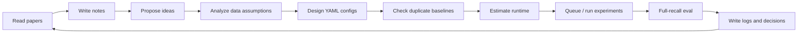
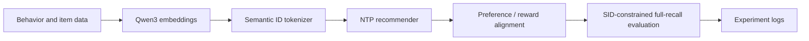

# nanoGenRec

[](LICENSE)
[](https://colab.research.google.com/github/yzq986/nanoGenRec/blob/master/public_benchmarks/nanogenrec_colab.ipynb)
[](requirements.txt)

[English](README.md) | [Chinese](README.zh.md)

**An agentic research framework for Generative Recommendation.**

nanoGenRec is a working research workspace where an AI agent can read papers, propose ideas, design YAML experiments, check duplicate baselines, estimate runtime, queue jobs, run full-recall evaluation, and preserve the decision trail. Generative Recommendation is the proving ground: the repo implements a full Semantic-ID GR stack from item embeddings to reward alignment and evaluation, but the main artifact is the reproducible research loop around it.

The shortest description:

```text
papers + ideas + configs + queues + eval + logs
        -> agent-managed recommendation research
        -> reproducible decisions, not just isolated scores
```

## What Makes This Repo Different

Most recommendation repos release a model, a training script, or a benchmark number. nanoGenRec releases the surrounding research operating system:

- **Research-agent protocol**: inbox/outbox files, status tracking, decision records, and paper notes for asynchronous human-agent collaboration.
- **Experiment compiler**: YAML configs expand into reproducible runs with duplicate-baseline checks.
- **Queue and monitoring discipline**: long jobs are queued, state is tracked, and results are committed back into the repo.
- **Evidence ledger**: 51 experiment logs record hypotheses, configs, outcomes, failed runs, and post-hoc analysis.
- **Full evaluation contract**: reported numbers use SID-constrained full-recall evaluation rather than training-time health checks.
- **Runnable public proof**: MovieLens + Colab T4 verifies that the released code path works without private data.

The GR implementation matters because it stress-tests the framework across multiple coupled stages: Qwen3 item embeddings, Semantic IDs, NTP training, preference/RL alignment, and full-recall evaluation.

## Agent Framework



The agent framework is documented in [research/program.md](research/program.md). It defines the operating loop, priority ladder, time budget policy, inbox/outbox schema, runtime estimation, and update protocol.

| Component | Purpose |
|-----------|---------|
| [research/program.md](research/program.md) | Operating manual for the autonomous research agent. |
| [research/inbox/](research/inbox/) | Human instructions to be consumed asynchronously. |
| [research/outbox/](research/outbox/) | Agent proposals, findings, blockers, and reports. |
| [research/paper-notes/](research/paper-notes/) | Structured notes from GR papers. |
| [research/decisions/](research/decisions/) | Durable decision records. |
| [research/status.md](research/status.md) | Current task, progress, and next action. |
| [experiments/run_exp.py](experiments/run_exp.py) | YAML experiment runner with duplicate-run checks. |
| [experiments/queue.txt](experiments/queue.txt) | Append-only queue for long-running jobs. |
| [experiments/logs/](experiments/logs/README.md) | Human-readable experiment ledger. |

## GR Stack Used As The Testbed



| Stage | Production path | Public MovieLens path |
|-------|-----------------|-----------------------|
| Item representation | Qwen3 0.6B / 4B embeddings | Qwen3-Embedding-0.6B over movie metadata |
| SID tokenization | RKMeans / FSQ, 4096/8192 codebooks | CPU residual KMeans, 64x64x64 |
| Sequence construction | Date-windowed behavior shards | MovieLens sliding next-item prefixes |
| NTP model | Transformer + MoE S/M/L tiers | Dense 3-layer NTP, embed_dim=128 |
| Alignment | SP-DPO / RF-DPO / GRPO / ECPO | public GRPO exact-SID reward |
| Evaluation | full SID-constrained recall | beam=1000, 1,000 eval users |

## Evidence That The Loop Works

These numbers are not presented as a public leaderboard claim. They show that the framework can drive real experiments end to end, surface failures, and preserve useful research evidence.

| Evidence | Result | Source |
|----------|--------|--------|
| Public runnable proof | MovieLens 1M Qwen+RL Colab T4: R@500=72.2%, R@1000=86.0% | [ml-1m-qwen-rl-t4](public_benchmarks/results/ml-1m-qwen-rl-t4.md) |
| Full-eval production line | M-tier 4B SID model: R@500=70.4%, R@10=14.2% over ~49K eval items | [NTP logs](experiments/logs/ntp/README.md) |
| Model scaling | 7 model sizes, 1.7M to 101.1M active params, fitted exponent 0.456 | [EXP-015](experiments/logs/exp-015.md) |
| Data-window diagnosis | up to 7.85M users and 299.0M raw interactions; longer windows are not monotonic | [EXP-016](experiments/logs/exp-016.md) |
| Tokenizer sweep | 14 SID variants over Qwen3 0.6B/4B embeddings and 4096/8192 codebooks | [EXP-049](experiments/logs/exp-049.md) |
| Alignment failure/recovery | off-policy ECPO collapse R@500=2.0%; on-policy candidates recover to 67.8% | [EXP-029](experiments/logs/exp-029.md) |

## Current Public Baselines

MovieLens 1M, `min_rating=4.0`, `min_user_items=10`, `max_items_per_user=100`, final item as target, 1,000 sampled eval users.

| Method | R@1 | R@5 | R@10 | R@50 | R@100 | R@500 | R@1000 |
|--------|-----|-----|------|------|-------|-------|--------|
| Popularity | 0.5% | 1.4% | 2.2% | 10.6% | 20.6% | 56.1% | 74.7% |
| Last item repeat | 0.0% | 0.0% | 0.0% | 0.0% | 0.0% | 0.0% | 0.0% |
| ItemKNN co-occurrence | 2.5% | 8.4% | 13.9% | 33.7% | 46.6% | 78.0% | 88.5% |
| nanoGenRec hybrid path | 1.9% | 6.2% | 10.5% | 29.0% | 40.4% | 72.5% | 85.2% |
| nanoGenRec Qwen+RL path | 2.2% | 6.7% | 10.0% | 27.9% | 38.4% | 72.2% | 86.0% |

Baseline reading: the public GR path beats global popularity at every cutoff and reaches the strongest checked-in public R@1000. A simple ItemKNN remains stronger at R@10--R@500 on dense MovieLens 1M. That is fine for the repo's purpose: the public run is a reproducibility proof for the framework, while the research value is in the agent-managed experiment system and production-grounded GR logs.

## Quick Start

Install dependencies:

```bash
python -m pip install -r requirements.txt
```

Run the public proof on a free GPU:

[Open the Colab notebook](https://colab.research.google.com/github/yzq986/nanoGenRec/blob/master/public_benchmarks/nanogenrec_colab.ipynb), then choose `Runtime -> Change runtime type -> T4 GPU`.

Run a fast local smoke test:

```bash
python run.py public-movielens \
    --dataset ml-latest-small \
    --output_dir public_benchmarks/runs/ml-latest-small-smoke \
    --epochs 1 \
    --max_users 200 \
    --clusters 16,16,16 \
    --embed_dim 32 \
    --layers 1 \
    --rl_steps 1 \
    --rl_batch_size 2 \
    --rl_group_size 4 \
    --eval_samples 20 \
    --beam_size 10
```

Run production-style GR commands from the repository root:

```bash
# Train tokenizer and produce Semantic IDs
python run.py train --model qwen3-0.6b

# Reuse an existing embedding cache
python run.py train --model qwen3-0.6b --skip_embedding

# Build NTP shards
python run.py preprocess-ntp \
    --sid_cache experiments/sid_cache/<sid-cache-name> \
    --output_dir experiments/ntp_data/<data-name> \
    --date_start 2026-03-18 \
    --date_end 2026-03-31

# Train from YAML
python experiments/run_exp.py experiments/configs/exp-047.yaml --no-smoke --commit

# Full evaluation
PYTHONPATH=. torchrun --nproc_per_node=8 run.py eval-ntp \
    --checkpoint experiments/ntp_checkpoints/<name> \
    --n_recall 1000
```

## Experiment Workflow

New experiments use `experiments/run_exp.py` with YAML configs:

```bash
# Inspect defaults
sed -n '1,220p' experiments/configs/_base.yaml

# Check for similar historical runs
python experiments/run_exp.py experiments/configs/exp-NNN.yaml --check

# Run all variants
python experiments/run_exp.py experiments/configs/exp-NNN.yaml --no-smoke --commit

# Resume or run one variant
python experiments/run_exp.py experiments/configs/exp-NNN.yaml --only expNNN-a --no-smoke
```

Queue long-running experiments:

```bash
echo "run_config.sh experiments/configs/exp-NNN.yaml  /tmp/expNNN.log  exp-NNN complete!" >> experiments/queue.txt
```

Inline eval during `train-ntp` is a health check only. Reported numbers should come from full eval with `run.py eval-ntp --n_recall 1000`.

## Repository Layout

| Path | Purpose |
|------|---------|
| [research/](research/program.md) | Agent operating manual, inbox/outbox protocol, status, decisions, paper notes. |
| [experiments/](experiments/README.md) | YAML configs, orchestration, queues, checkpoints, artifacts. |
| [experiments/logs/](experiments/logs/README.md) | Phase-level experiment ledger and SOTA summaries. |
| [public_benchmarks/](public_benchmarks/README.md) | Redistributable MovieLens runs, Colab notebook, public baselines. |
| [tokenizer/](tokenizer/README.md) | Semantic ID tokenizers and SID preprocessing. |
| [ntp/](ntp/README.md) | Generative recommendation model, preprocessing, training, evaluation. |
| [rl/](rl/README.md) | Preference and RL alignment methods. |
| [eval/](eval/README.md) | Evaluation wrappers, behavior metrics, full-recall reports. |
| [data/](data/README.md) | Data export, loading, embedding synchronization, distributed encoding. |
| [paper/](paper/README.md) | arXiv-style technical report draft and source bundle. |
| [docs/](docs/README.md) | Architecture notes, engineering logs, stable documentation. |

## Environment

The standard training/evaluation environment used for production experiments is `/home/dev/.conda/envs/gr`.

| Package | Version |
|---------|---------|
| Python | 3.12.13 |
| torch | 2.7.1+cu128 |
| CUDA driver | 12.8 |
| faiss-gpu | 1.14.1 |
| numpy | 2.4.4 |
| pandas | 3.0.2 |
| pyarrow | 24.0.0 |

## Paper, License, Citation

- Technical report draft: [paper/nanogenrec.pdf](paper/nanogenrec.pdf)
- arXiv source bundle: [paper/nanogenrec-arxiv-source.tar.gz](paper/nanogenrec-arxiv-source.tar.gz)
- License: [MIT](LICENSE)
- Citation metadata: [CITATION.cff](CITATION.cff)

## Notes For Contributors

- Use `python run.py <command>` from the repository root.
- The repository root is added directly to `PYTHONPATH`; imports do not use a package prefix.
- Do not compare `train-ntp` inline eval with full baselines.
- Keep module READMEs for implementation details and `experiments/logs/<phase>/README.md` for experiment planning summaries.
