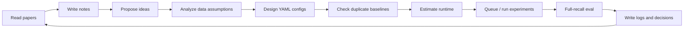
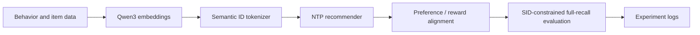

# nanoGenRec

[](LICENSE)
[](https://colab.research.google.com/github/yzq986/nanoGenRec/blob/master/public_benchmarks/nanogenrec_colab.ipynb)
[](requirements.txt)

[English](README.md) | [中文](README.zh.md)

**一个面向生成式推荐的 agentic research framework。**

nanoGenRec 是一个真实工作的研究 workspace：AI agent 可以读论文、写 paper notes、提出 idea、设计 YAML 实验、检查重复 baseline、估算运行时间、排队训练、跑全量评测，并把实验结论和决策沉淀到仓库里。Generative Recommendation 是这个框架的验证场景：repo 里确实实现了从 item embeddings 到 Semantic IDs、NTP、reward alignment、full-recall eval 的完整 GR 栈，但最重要的产出是围绕它的可复现研究闭环。

最短描述：

```text
papers + ideas + configs + queues + eval + logs
        -> agent-managed recommendation research
        -> reproducible decisions, not just isolated scores
```

## 这个 Repo 的特别之处

大多数推荐 repo 发布的是一个模型、一段训练脚本或一个 benchmark 数字。nanoGenRec 更像是把研究操作系统一起发布出来：

- **Research-agent protocol**：inbox/outbox、状态跟踪、decision records、paper notes，支持异步 human-agent collaboration。
- **Experiment compiler**：YAML configs 展开成可复现实验，并自动检查重复 baseline。
- **Queue and monitoring discipline**：长任务进入队列，状态可追踪，结果回写并提交到仓库。
- **Evidence ledger**：51 个实验日志记录 hypothesis、config、结果、失败案例和 post-hoc analysis。
- **Full evaluation contract**：正式数字来自 SID-constrained full-recall eval，而不是训练时 inline health check。
- **Runnable public proof**：MovieLens + Colab T4 证明开源路径不依赖私有数据也能跑通。

GR 实现本身也重要，因为它压测了一个多阶段耦合系统：Qwen3 item embeddings、Semantic IDs、NTP training、preference/RL alignment 和 full-recall evaluation。

## Agent Framework



agent framework 的细节见 [research/program.md](research/program.md)，里面定义了 operating loop、priority ladder、time budget、inbox/outbox schema、runtime estimation 和更新协议。

| Component | Purpose |
|-----------|---------|
| [research/program.md](research/program.md) | autonomous research agent 操作手册。 |
| [research/inbox/](research/inbox/) | 人类异步下发的指令。 |
| [research/outbox/](research/outbox/) | agent 产出的 proposal、finding、blocker、report。 |
| [research/paper-notes/](research/paper-notes/) | GR 论文结构化笔记。 |
| [research/decisions/](research/decisions/) | 长期决策记录。 |
| [research/status.md](research/status.md) | 当前任务、进度和下一步。 |
| [experiments/run_exp.py](experiments/run_exp.py) | 带重复实验检查的 YAML runner。 |
| [experiments/queue.txt](experiments/queue.txt) | 长任务 append-only 队列。 |
| [experiments/logs/](experiments/logs/README.md) | 可审计实验日志。 |

## 作为验证场的 GR Stack



| Stage | 生产路径 | 公开 MovieLens 路径 |
|-------|----------|---------------------|
| Item representation | Qwen3 0.6B / 4B embeddings | Qwen3-Embedding-0.6B over movie metadata |
| SID tokenization | RKMeans / FSQ, 4096/8192 codebooks | CPU residual KMeans, 64x64x64 |
| Sequence construction | 按日期窗口构建行为 shards | MovieLens sliding next-item prefixes |
| NTP model | Transformer + MoE S/M/L tiers | Dense 3-layer NTP, embed_dim=128 |
| Alignment | SP-DPO / RF-DPO / GRPO / ECPO | public GRPO exact-SID reward |
| Evaluation | full SID-constrained recall | beam=1000, 1,000 eval users |

## 证明这条链路能工作

这些数字不是 public leaderboard claim。它们证明的是：框架能驱动真实实验、暴露失败、保留研究证据。

| Evidence | Result | Source |
|----------|--------|--------|
| 公开可运行证明 | MovieLens 1M Qwen+RL Colab T4：R@500=72.2%、R@1000=86.0% | [ml-1m-qwen-rl-t4](public_benchmarks/results/ml-1m-qwen-rl-t4.md) |
| 生产链路 full eval | M-tier 4B SID：约 49K eval items 上 R@500=70.4%、R@10=14.2% | [NTP logs](experiments/logs/ntp/README.md) |
| Model scaling | 7 个模型规模，1.7M 到 101.1M active params，拟合 exponent 0.456 | [EXP-015](experiments/logs/exp-015.md) |
| Data-window diagnosis | 最大 7.85M users、299.0M raw interactions；更长窗口不单调 | [EXP-016](experiments/logs/exp-016.md) |
| Tokenizer sweep | 14 个 SID variants，覆盖 Qwen3 0.6B/4B embeddings 和 4096/8192 codebooks | [EXP-049](experiments/logs/exp-049.md) |
| Alignment failure/recovery | off-policy ECPO collapse R@500=2.0%；on-policy candidates 恢复到 67.8% | [EXP-029](experiments/logs/exp-029.md) |

## 当前 Public Baseline 水平

MovieLens 1M，`min_rating=4.0`、`min_user_items=10`、`max_items_per_user=100`、最后一个 item 作为 target，采样 1,000 个 eval users。

| Method | R@1 | R@5 | R@10 | R@50 | R@100 | R@500 | R@1000 |
|--------|-----|-----|------|------|-------|-------|--------|
| Popularity | 0.5% | 1.4% | 2.2% | 10.6% | 20.6% | 56.1% | 74.7% |
| Last item repeat | 0.0% | 0.0% | 0.0% | 0.0% | 0.0% | 0.0% | 0.0% |
| ItemKNN co-occurrence | 2.5% | 8.4% | 13.9% | 33.7% | 46.6% | 78.0% | 88.5% |
| nanoGenRec hybrid path | 1.9% | 6.2% | 10.5% | 29.0% | 40.4% | 72.5% | 85.2% |
| nanoGenRec Qwen+RL path | 2.2% | 6.7% | 10.0% | 27.9% | 38.4% | 72.2% | 86.0% |

Baseline 解读：公开 GR 路径在所有 cutoff 上超过 global popularity，R@1000 是当前 checked-in public runs 里最强；但 MovieLens 1M 是小而密的协同过滤数据集，简单 ItemKNN 在 R@10--R@500 仍然更强。这没关系，因为这里的 public run 主要是框架可复现证明，repo 的研究价值在 agent-managed experiment system 和生产 grounded 的 GR 日志。

## Quick Start

安装依赖：

```bash
python -m pip install -r requirements.txt
```

在免费 GPU 上跑 public proof：

[打开 Colab notebook](https://colab.research.google.com/github/yzq986/nanoGenRec/blob/master/public_benchmarks/nanogenrec_colab.ipynb)，然后选择 `Runtime -> Change runtime type -> T4 GPU`。

本地快速 smoke test：

```bash
python run.py public-movielens \
    --dataset ml-latest-small \
    --output_dir public_benchmarks/runs/ml-latest-small-smoke \
    --epochs 1 \
    --max_users 200 \
    --clusters 16,16,16 \
    --embed_dim 32 \
    --layers 1 \
    --rl_steps 1 \
    --rl_batch_size 2 \
    --rl_group_size 4 \
    --eval_samples 20 \
    --beam_size 10
```

生产风格 GR 命令都从仓库根目录运行：

```bash
# 训练 tokenizer 并生成 Semantic IDs
python run.py train --model qwen3-0.6b

# 复用已有 embedding cache
python run.py train --model qwen3-0.6b --skip_embedding

# 构建 NTP 数据分片
python run.py preprocess-ntp \
    --sid_cache experiments/sid_cache/<sid-cache-name> \
    --output_dir experiments/ntp_data/<data-name> \
    --date_start 2026-03-18 \
    --date_end 2026-03-31

# 通过 YAML 训练
python experiments/run_exp.py experiments/configs/exp-047.yaml --no-smoke --commit

# 全量评测
PYTHONPATH=. torchrun --nproc_per_node=8 run.py eval-ntp \
    --checkpoint experiments/ntp_checkpoints/<name> \
    --n_recall 1000
```

## 实验工作流

新实验统一使用 `experiments/run_exp.py` 和 YAML configs：

```bash
# 查看默认参数
sed -n '1,220p' experiments/configs/_base.yaml

# 检查是否已有相似实验
python experiments/run_exp.py experiments/configs/exp-NNN.yaml --check

# 跑所有 variants
python experiments/run_exp.py experiments/configs/exp-NNN.yaml --no-smoke --commit

# 恢复或只跑一个 variant
python experiments/run_exp.py experiments/configs/exp-NNN.yaml --only expNNN-a --no-smoke
```

长任务通过队列追加：

```bash
echo "run_config.sh experiments/configs/exp-NNN.yaml  /tmp/expNNN.log  exp-NNN complete!" >> experiments/queue.txt
```

`train-ntp` 的 inline eval 只用于健康检查。正式报告数字应来自 `run.py eval-ntp --n_recall 1000` 的全量评测。

## 目录结构

| 路径 | 作用 |
|------|------|
| [research/](research/program.md) | Agent operating manual、inbox/outbox 协议、status、decisions、paper notes。 |
| [experiments/](experiments/README.md) | YAML configs、编排、队列、checkpoints、artifacts。 |
| [experiments/logs/](experiments/logs/README.md) | 分阶段实验 ledger 和 SOTA 汇总。 |
| [public_benchmarks/](public_benchmarks/README.md) | 可分发 MovieLens runs、Colab notebook、public baselines。 |
| [tokenizer/](tokenizer/README.md) | Semantic ID tokenizer 和 SID 预处理。 |
| [ntp/](ntp/README.md) | 生成式推荐模型、预处理、训练、评测。 |
| [rl/](rl/README.md) | 偏好学习和 RL alignment。 |
| [eval/](eval/README.md) | 评测 wrappers、行为指标、全量召回报告。 |
| [data/](data/README.md) | 数据导出、加载、embedding 同步、分布式编码。 |
| [paper/](paper/README.md) | arXiv-style technical report draft 和 source bundle。 |
| [docs/](docs/README.zh.md) | 架构、工程记录和稳定文档。 |

## 环境

生产实验标准环境是 `/home/dev/.conda/envs/gr`。

| Package | Version |
|---------|---------|
| Python | 3.12.13 |
| torch | 2.7.1+cu128 |
| CUDA driver | 12.8 |
| faiss-gpu | 1.14.1 |
| numpy | 2.4.4 |
| pandas | 3.0.2 |
| pyarrow | 24.0.0 |

## 论文、许可证、引用

- 技术报告草稿：[paper/nanogenrec.pdf](paper/nanogenrec.pdf)
- arXiv source bundle：[paper/nanogenrec-arxiv-source.tar.gz](paper/nanogenrec-arxiv-source.tar.gz)
- License：[MIT](LICENSE)
- Citation metadata：[CITATION.cff](CITATION.cff)

## 贡献者注意事项

- 从仓库根目录使用 `python run.py <command>`。
- 仓库根目录会直接加入 `PYTHONPATH`，import 不使用 package prefix。
- 不要把 `train-ntp` inline eval 和 full baseline 直接比较。
- 模块 README 写实现细节；`experiments/logs/<phase>/README.md` 写实验规划和阶段结果。
