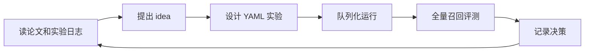
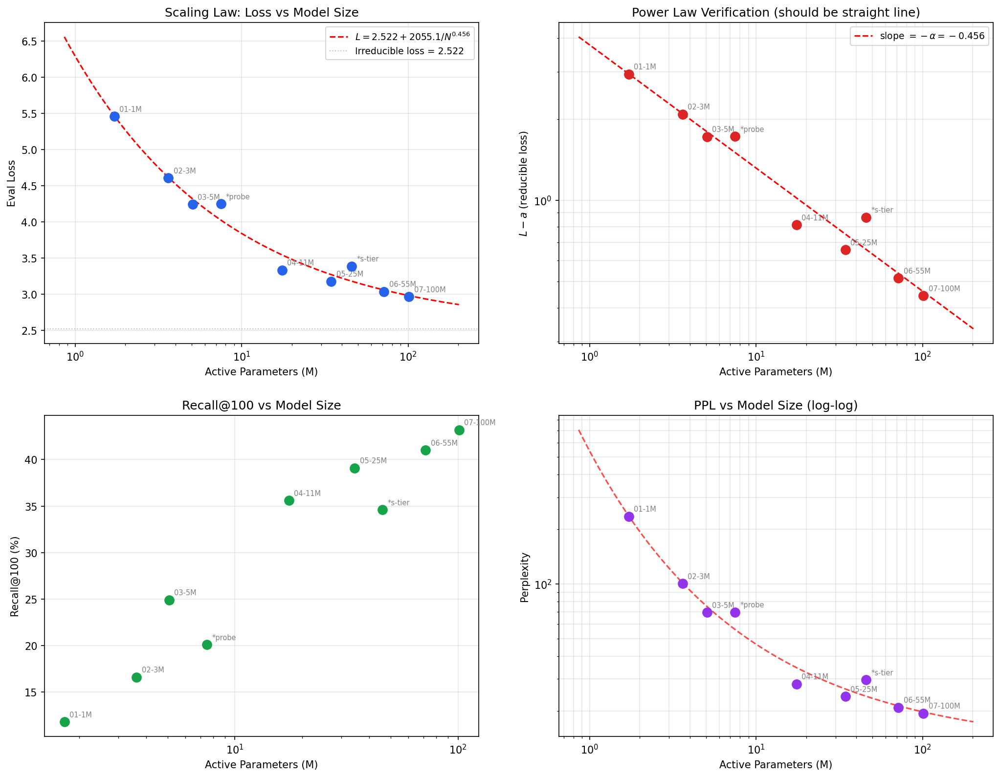
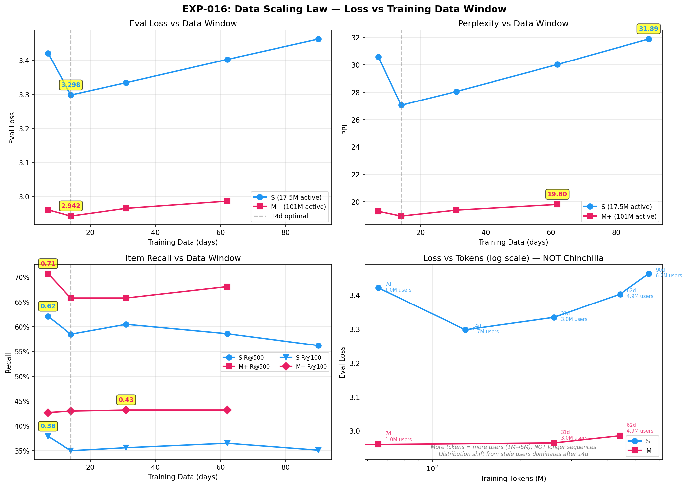
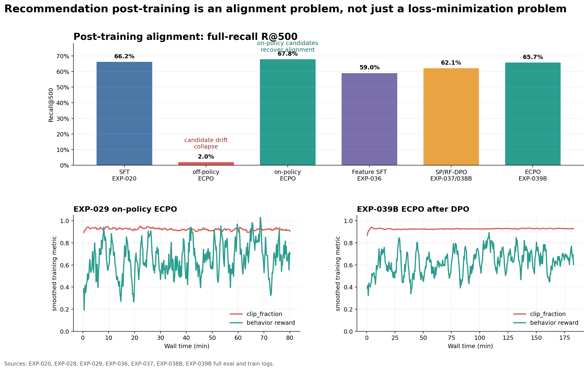
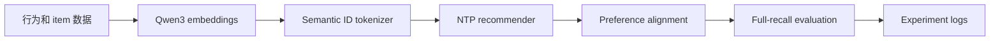

# nanoGenRec

[](LICENSE)
[](https://colab.research.google.com/github/yzq986/nanoGenRec/blob/master/public_benchmarks/nanogenrec_colab.ipynb)
[](requirements.txt)

[English](README.md) | [中文](README.zh.md)

[论文 PDF](paper/nanogenrec.pdf) | [arXiv source bundle](paper/nanogenrec-arxiv-source.tar.gz) | [打开 Colab 复现](https://colab.research.google.com/github/yzq986/nanoGenRec/blob/master/public_benchmarks/nanogenrec_colab.ipynb)

`nanoGenRec` 是一个面向生成式推荐的 agentic research framework。

它的核心不是单个模型或单个 benchmark 数字，而是把推荐研究变成一个可复现闭环：AI agent 可以读论文、写 idea、设计 YAML 实验、检查重复 baseline、估算运行时间、排队训练、跑全量评测，并把实验结论和决策沉淀到仓库里。

Generative Recommendation 是这个框架的验证场景和首个完整落地应用：repo 里包含从 Qwen3 item embeddings、Semantic ID tokenizer、NTP recommender、reward alignment 到 full-recall evaluation 的完整链路，并在生产规模日志和公开 MovieLens 数据上做了验证。

当前开源版本已经剥离私有数据和部署细节，但保留了可复现建模思路、实验自动化和工程工作流。

对于没有私有数据的用户，仓库也提供了公开 MovieLens 复现路径，可在免费 Colab T4 上跑严格框架链路：公开 ratings/metadata -> Qwen3 item embeddings -> residual KMeans Semantic IDs -> NTP 训练 -> GRPO-style reward alignment -> SID 约束全量召回评测。快速 CPU/hash-feature 设置保留为开发 smoke test；推荐公开复现入口见 [public_benchmarks/nanogenrec_colab.ipynb](public_benchmarks/nanogenrec_colab.ipynb)。

## 核心贡献

| 贡献 | 开源内容 |
|------|----------|
| Agentic research workflow | `research/` inbox/outbox 协议、paper notes、状态跟踪、decision records 和操作手册。 |
| Experiment operating system | YAML configs、重复实验检查、runtime 估算、队列化脚本和已提交实验产物。 |
| Evidence ledger | 51 个实验日志，记录 hypothesis、config、成功结果、失败案例、invalid runs 和 post-hoc analysis。 |
| GR implementation | Semantic ID tokenizer、NTP recommender、preference/RL alignment 和 SID 约束全量召回评测。 |
| Public proof path | MovieLens 1M Colab T4 跑通 Qwen embeddings -> SID -> NTP -> RL -> eval，不依赖私有数据。 |

## Agentic Research Loop



这个仓库把推荐研究视为一个可以被 AI agent 编排的自主实验问题。`research/` 提供人类和 agent 协作的 inbox/outbox 协议、paper notes、状态面板和决策记录；`experiments/run_exp.py` 负责展开 YAML config、检查重复 baseline、运行 variants，并在实验完成后提交结果；`experiments/queue.txt` 和 `run_config.sh` 支持长任务异步排队。这是 repo 最重要的部分；下面的 GR 数字主要证明这套 research loop 能驱动一个非平凡的多阶段系统。

## 量化概览

| 维度 | 规模 / 结果 | 来源 |
|------|-------------|------|
| Agentic workflow | inbox/outbox 协议、paper-note memory、YAML config expansion、重复实验检查、队列化运行和 decision records | [research/](research/program.md), [experiments/](experiments/README.md) |
| 实验记录 | 51 个已记录实验，覆盖 tokenizer、NTP、side features、temporal encoding 和 RL alignment | [experiments/logs/](experiments/logs/README.md) |
| 行为数据 sweep | 最大窗口覆盖 7.85M 用户、299.0M raw interactions，截断后约 445M effective SID tokens | [EXP-016](experiments/logs/exp-016.md) |
| Scaling law sweep | 7 个模型规模，从 1.7M 到 101.1M active parameters，在 262M tokens 上拟合 | [EXP-015](experiments/logs/exp-015.md) |
| Tokenizer sweep | 14 个 Semantic ID variants，覆盖 0.6B/4B embeddings、4096/8192 codebooks 和 FSQ hidden sizes | [EXP-049](experiments/logs/exp-049.md) |
| NTP 最好全量评测 | M-tier 4B SID 模型在约 49K eval items 上达到 R@500=70.4%、R@10=14.2% | [EXP-043](experiments/logs/ntp/README.md) |
| 后训练最好恢复 | on-policy ECPO 将 off-policy collapse 从 R@500=2.0% 恢复到 67.8% | [EXP-029](experiments/logs/exp-029.md) |
| 公开复现路径 | MovieLens 1M strict Qwen+RL Colab T4 run：5,950 用户、3,532 items，R@500=72.2%、R@1000=86.0% | [public_benchmarks/results/ml-1m-qwen-rl-t4.md](public_benchmarks/results/ml-1m-qwen-rl-t4.md) |

## 公开可复现证明

公开 MovieLens run 的作用是证明开源链路在没有私有数据时也能完整跑通，不是 repo 的主研究 claim，也不是 tuned leaderboard submission。在 MovieLens 1M 上，严格的 Qwen -> SID -> NTP -> RL -> eval 路径可在 Colab T4 上运行，覆盖 5,950 users、3,532 items、348,363 training examples 和 1,000 sampled eval users，达到 R@500=72.2%、R@1000=86.0%。简单 baseline 的详细数字保留在 [public_benchmarks/results/ml-1m-baselines.md](public_benchmarks/results/ml-1m-baselines.md)，作为透明记录。

## 亮点

- **Agentic research loop**：论文阅读、idea 提出、实验设计、执行、评估和决策记录都围绕 human-agent collaboration 组织。
- **Experiment operating system**：YAML configs、重复实验检查、队列化长任务、已提交 artifacts 和阶段日志。
- **真实 GR 实验谱系**：核心建模选择来自大规模真实行为日志上的实验验证，不是 synthetic toy benchmark。
- **端到端 Semantic ID pipeline**：Qwen3 embedding -> residual KMeans + FSQ -> 3-token item ID。
- **生成式推荐模型**：Transformer + MoE，在行为序列上做 next-token prediction。
- **偏好对齐链路**：SP-DPO、RF-DPO、GRPO、ECPO。
- **全量召回评测**：SID 约束 beam search、Recall@K、tokenizer proxy metrics 和对比报告。
- **公开 T4 复现路径**：MovieLens 可在免费 T4 上跑 Qwen3 embeddings、residual KMeans SIDs、NTP、GRPO-style alignment 和全量召回评测。
- **开发 smoke path**：hash-feature MovieLens 设置不依赖 Qwen embeddings、Faiss 或 GPU，用于快速 CI 检查。

参考论文：[OneRec](https://arxiv.org/abs/2506.13695)、[OneRec-V2](https://arxiv.org/abs/2508.20900)、[GR4AD](https://arxiv.org/abs/2602.22732)、[OneMall](https://arxiv.org/abs/2601.21770)。

## 技术产出

这个仓库的核心产出不是单个 checkpoint，而是一组围绕 Semantic-ID-based generative recommendation 的训练规律和后训练配方。

### NTP Scaling Law



EXP-015 覆盖了 1.7M 到 101M active parameters 的 7 个模型规模，并拟合出：

```text
L(N) = 2.522 + 2055.1 / N^0.456
```

这个 exponent 接近 OneRec-V2 报告的 0.489，全量评测 R@500 从 23.6% 提升到 66.2%。当前比较有效的模型规模区间在 50M-70M active parameters 左右，再往上收益开始明显受数据限制。

### Data Scaling Law



EXP-016 说明行为窗口变长并不天然单调变好。recency、用户覆盖和单用户序列深度会互相影响，所以数据 scaling 需要显式控制变量，而不是简单地认为“天数越多越好”。

### Post-Training Alignment



后训练是这个项目从 SFT 往上走的关键。EXP-028 里的 off-policy ECPO 出现 candidate drift，R@500 掉到 2.0%；EXP-029 改成 on-policy candidates 后恢复到 R@500=67.8%。在带特征的 S-tier pipeline 上，DPO 之后继续做 ECPO，把 R@500 从 62.1% 提升到 65.7%。

## 结果索引

| 方向 | 当前最好结果 | 代表实验 | 详情 |
|------|-------------|----------|------|
| Semantic ID tokenizer | 4096x3 binary `[2]x12`，snHR=0.095，CR=0.89% | EXP-012 | [tokenizer logs](experiments/logs/tokenizer/README.md) |
| Embedding scale | 4B SID snHR=0.131；0.6B SID snHR=0.092 | EXP-049 | [tokenizer logs](experiments/logs/tokenizer/README.md) |
| NTP recommender | M-tier bare R@500=70.2%；L-tier SFT R@500=64.1% | EXP-043 / EXP-047 | [NTP logs](experiments/logs/ntp/README.md) |
| RL alignment | S-tier 链路上 ECPO R@500=65.7% | EXP-039B | [RL logs](experiments/logs/rl/README.md) |

EXP-049 确认 `num_clusters=8192` 是更强 tokenizer 设置。当前推荐 SID cache 是 `exp049-0.6b-nc8192-h128` 和 `exp049-4b-nc8192-h128`。

## 项目流程



所有项目命令从仓库根目录运行：

```bash
python run.py <command>
```

分布式任务使用：

```bash
PYTHONPATH=. torchrun --nproc_per_node=8 run.py <command>
```

## 快速开始

先安装依赖：

```bash
python -m pip install -r requirements.txt
```

```bash
# 训练 tokenizer 并生成 Semantic IDs
python run.py train --model qwen3-0.6b

# 复用已有 embedding cache
python run.py train --model qwen3-0.6b --skip_embedding

# 构建 NTP 数据分片
python run.py preprocess-ntp \
    --sid_cache experiments/sid_cache/<sid-cache-name> \
    --output_dir experiments/ntp_data/<data-name> \
    --date_start 2026-03-18 \
    --date_end 2026-03-31

# 通过 YAML config 运行实验
python experiments/run_exp.py experiments/configs/exp-047.yaml --no-smoke --commit

# 全量评测
PYTHONPATH=. torchrun --nproc_per_node=8 run.py eval-ntp \
    --checkpoint experiments/ntp_checkpoints/<name> \
    --n_recall 1000
```

标准训练/评测环境是 `/home/dev/.conda/envs/gr`。

| Package | Version |
|---------|---------|
| Python | 3.12.13 |
| torch | 2.7.1+cu128 |
| CUDA driver | 12.8 |
| faiss-gpu | 1.14.1 |
| numpy | 2.4.4 |
| pandas | 3.0.2 |
| pyarrow | 24.0.0 |

## 实验工作流

新实验统一走 `experiments/run_exp.py` + YAML config。这样可以显式继承默认参数，避免重复跑 baseline，并让结果可比较。

```bash
# 写 config 前先看默认值
sed -n '1,220p' experiments/configs/_base.yaml

# 检查是否已有相似实验
python experiments/run_exp.py experiments/configs/exp-NNN.yaml --check

# 跑所有 variants
python experiments/run_exp.py experiments/configs/exp-NNN.yaml --no-smoke --commit

# 只跑或恢复一个 variant
python experiments/run_exp.py experiments/configs/exp-NNN.yaml --only expNNN-a --no-smoke
```

长任务通过队列追加：

```bash
echo "run_config.sh experiments/configs/exp-NNN.yaml  /tmp/expNNN.log  exp-NNN complete!" >> experiments/queue.txt
```

`train-ntp` 的 inline eval 只用于健康检查。正式报告数字必须来自 `run.py eval-ntp --n_recall 1000` 的全量评测。

## 目录结构

| 路径 | 作用 |
|------|------|
| [data/](data/README.md) | 数据导出、加载、embedding 同步和分布式编码。 |
| [tokenizer/](tokenizer/README.md) | Semantic ID tokenizer 和 SID 预处理。 |
| [ntp/](ntp/README.md) | 生成式推荐模型、预处理、训练和评测。 |
| [rl/](rl/README.md) | 偏好学习和 RL 对齐。 |
| [eval/](eval/README.md) | 评测 wrapper、行为指标、全量召回报告和对比。 |
| [metrics/](metrics/README.md) | tokenizer / embedding 的 intrinsic 和 behavior-aware metrics。 |
| [model/](model/README.md) | embedding wrapper、模型打包和兼容 shim。 |
| [viz/](viz/README.md) | 训练后可视化工具。 |
| [experiments/](experiments/README.md) | configs、编排、队列、checkpoints 和结果产物。 |
| [experiments/logs/](experiments/logs/README.md) | 分阶段实验记录和 SOTA 汇总。 |
| [docs/](docs/README.zh.md) | 架构、工程记录和长期文档。 |
| [ideas/](ideas/README.md) | 按改进方向组织的研究 backlog。 |

## 许可证

代码使用 [MIT License](LICENSE) 发布。

## 文档分工

| 文件 | 读者 | 内容 |
|------|------|------|
| `README.md` / `README.zh.md` | 新访客 | 项目定位、快速开始、核心结果和文档入口。 |
| `<phase>/README.md` | 改代码的人 | 模块职责、接口、数据契约、实现细节和注意事项。 |
| `experiments/logs/<phase>/README.md` | 设计实验的人 | 当前最好结果、实验列表、下一步方向和指标口径。 |
| `docs/` | 长期维护者 | 架构决策、工程记录和稳定文档。 |

## 注意事项

- 仓库根目录直接加入 `PYTHONPATH`，模块导入不带包名前缀。
- CLI 入口是 `python run.py <command>`，不是 `python -m <package>`。
- 独立 shell 脚本需要先把 `PYTHONPATH` 设置为仓库根目录。

## 引用

如果 nanoGenRec 对你的工作有帮助，请引用本仓库和技术报告。引用元数据也见
[CITATION.cff](CITATION.cff)。

```bibtex
@misc{ye2026nanogenrec,
  title        = {nanoGenRec: An Agentic Research Framework for Landing Semantic-ID Generative Recommendation},
  author       = {Ye, Ziqing},
  year         = {2026},
  url          = {https://github.com/yzq986/nanoGenRec},
  note         = {Open-source repository and technical report}
}
```
