# Ideas

从论文/技术文章中提炼的实验想法，按**改进维度**组织。每个文件对应一个维度，包含该方向所有 idea 的演进关系、实验设计和优先级评估。

想法成熟后迁移到 `experiments/log.md` 作为正式实验。

## 文件索引

| 文件 | 维度 | Ideas 数 | P0 |
|------|------|---------|-----|
| [tokenizer.md](tokenizer.md) | 量化方法 (RQ/OPQ/FSQ/Balanced/Co-gen/Collision/Capacity/VRQ/MMQ/GeoSID/DualCodebook/Rebalance) | 14 | ~~sid-0~~ ❌ |
| [embedding.md](embedding.md) | 表征增强 (协同/多模态/属性/Caption) | 6 | — |
| [architecture.md](architecture.md) | 模型架构 (LazyAR/QFormer/SoftPrompt/Reasoning/Diffusion/CoA/MultiStream/Session-MIM/HierIdx/OneRanker/InTextReason/MoEReason/TokenMerger/NextScale/CascadedSparseDene) | 24 | — |
| [training.md](training.md) | 训练目标 (Contrastive/MTP/Value/ENTP/NSP/TaskDecomp/MultiBiz/InstrMultiTask/MemoryBank/PW-NTP/ReverseCurriculum/LAC/OneLive-BOS/CF-SoftLabel) | 20 | ~~onemall-0~~ ❌ (EXP-022 负结果) |
| [rl-alignment.md](rl-alignment.md) | RL 对齐 (GRPO/DPO/ECPO/Progressive/Listwise/HEPO/A2PO/GRPO-SR/RPO/ElasticTether) | 12 | — |
| [inference.md](inference.md) | 推理优化 (Dynamic Beam/CSR约束/Register压缩/PRM-Beam/GRC/FP8-PTQ) | 7 | — |
| [scaling.md](scaling.md) | 扩展性 (序列长度/MFU/Sparse Attn) | 3 | ~~oneloc-4~~ 部分完成 |
| [ntp-features.md](ntp-features.md) | NTP 特征注入 (TimeGap/ActionType/SegmentEmb/Category/UserProfile/ContTime) | 6 | ~~feat-0/1/2~~ ✅ (EXP-036 全部验证) |

**总计: 92 ideas (0 P0 活跃 / ~56 P1 / 28 P2 / 8 已完成或关闭)**

**已完成/关闭**: sid-0 ❌, sid-1 ❌, onemall-0 ❌(EXP-022), onemall-4 ✅, onemall-5 ✅, forge-0 ✅, oneloc-4 部分✅, feat-0/1/2 ✅(EXP-036), rpo-0 ✅(验证), spot-0 ✅(验证), uni-0 ❌, mtgr-0 ✅(train_packed), lac-0 ✅(EXP-025/036), onerec-3 暂缓P2

## 全局演进图

核心依赖链（红 = P0，蓝 = P1，灰虚线 = P2 折叠）。完整 idea 列表见各维度文件。

```mermaid
%%{ init: { 'flowchart': { 'curve': 'linear', 'rankSpacing': 60, 'nodeSpacing': 25 } } }%%
graph LR
    classDef p0 fill:#c62828,color:#fff,stroke:#b71c1c,font-weight:bold
    classDef p1 fill:#1565c0,color:#fff,stroke:#0d47a1
    classDef p2 fill:#546e7a,color:#fff,stroke:#455a64,stroke-dasharray:4

    %% ═══ Col 1: Tokenizer & Embedding ═══
    subgraph COL1 [" Tokenizer / Embedding "]
        direction TB
        SID0("sid-0 OPQ 并行 ID → EXP-004 ✅"):::p0
        GR0("gr4ad-0 MGMR 不等大码本"):::p1
        OM5("onemall-5 RKMeans+FSQ"):::p1
        SID2("sid-2 Balanced KMeans"):::p1
        FORGE0("forge-0 Proxy Metrics"):::p1
        PIT0("pit-0 Co-gen Tokenizer"):::p1
        SID1("sid-1 协同信号 / onemall-3 属性增强"):::p1
        QS0("quasid-0 Hamming Repulsion"):::p1
        R3V0("r3vae-0 Reference Vector SID"):::p1
        UNIREC1("unirec-1 Capacity-Constrained SID"):::p2
        P2_TOK("sid-3, oneloc-3 &nbsp;(2 P2)"):::p2
    end

    %% ═══ Col 2: Architecture & Training ═══
    subgraph COL2 [" Architecture / Training "]
        direction TB
        OM0("onemall-0 Contrastive Loss ❌ EXP-022"):::p2
        SID4("sid-4 MTP 辅助 Loss"):::p1
        GR1("gr4ad-1 LazyAR"):::p1
        PLUM0("plum-0 LLM CPT"):::p1
        GR2("gr4ad-2 Value-Aware"):::p1
        OM1("onemall-1 Query-Former"):::p1
        GLIDE0("glide-0 Soft Prompt"):::p1
        OL5("oneloc-5 Multi-behavior"):::p1
        DGR0("dualgr-0 ENTP-Loss"):::p1
        STAMP0("stamp-0 Semantic Pruning+MTP"):::p1
        S2GR0("s2gr-0 Reasoning Tokens"):::p1
        TBG0("tbg-0 Next Session Pred"):::p1
        GTI0("gti-0 Grounded Token Init"):::p1
        HSTU1B("hstu1b-0 Task Decomposition"):::p1
        UNIREC0("unirec-0 Chain-of-Attribute"):::p1
        GEMS0("gems-0 Multi-Stream Temporal"):::p1
        HPGR0("hpgr-0 Session-MIM + Pref Attn"):::p1
        METAIDX0("metaidx-0 层次化索引+TTT"):::p1
        ONERANKER0("oneranker-0 统一生成排序"):::p1
        OREC_THINK0("orec-think-0 In-Text Reasoning"):::p1
        REG4REC0("reg4rec-0 MoE推理自反思"):::p1
        SIGMA0("sigma-0 指令多任务GR"):::p1
        LEMUR0("lemur-0 E2E多模态+MemBank"):::p1
        GENREC0("genrec-0 Page-wise NTP"):::p1
        GENREC1("genrec-1 Token Merger"):::p1
        RCLREC0("rclrec-0 Reverse Curriculum"):::p1
        P2_ARCH("onemall-4, oneloc-0/1, oxygen-0, llada-0/mdgr-0, sid-5, gr2-0, higr-0, nsgr-0 &nbsp;(9 P2)"):::p2
    end

    %% ═══ Col 3: RL / Inference / Scaling ═══
    subgraph COL3 [" RL / Inference / Scaling "]
        direction TB
        OL4("oneloc-4 Scaling Law 序列长度≫模型"):::p0
        OM2("onemall-2 GRPO/DPO"):::p1
        AL0("align3-0 Progressive DPO"):::p1
        RPO0("rpo-0 RPO SFT Regularizer"):::p1
        SPOT0("spot-0 Elastic Tether"):::p1
        RG0("rankgr-0 Listwise DPO+Rescore"):::p1
        GR4("gr4ad-4 Dynamic Beam"):::p1
        STAT0("static-0 CSR 约束解码"):::p1
        EARN0("earn-0 Register 压缩"):::p1
        KUN0("kunlun-0 Rec Scaling Laws"):::p1
        HSTU0("hstu-0 Sparse Attn"):::p1
        PROMISE0("promise-0 PRM-guided Beam"):::p1
        GRC0("grc-0 Gen-Reflect-Correct"):::p1
        SGREC0("sgrec-0 A2PO + Semantic Judge"):::p1
        GENREC2("genrec-2 GRPO-SR Hybrid Reward"):::p1
        ORECV2("orecv2-0 FP8 PTQ"):::p1
        P2_RL("gr4ad-3, oneloc-2, uni-0, flame-0, gpr-0, mbgr-0 &nbsp;(6 P2)"):::p2
    end

    %% ═══ Edges: 只走 Col1→Col2→Col3，无回流 ═══
    SID0 --> SID4
    SID0 --> GR1
    SID0 --> STAT0
    SID0 --> STAMP0
    GR0 --> GR4
    FORGE0 --> SID4
    FORGE0 --> R3V0
    PIT0 --> GLIDE0
    SID1 --> OL5
    SID1 --> QS0

    OM0 --> OM2
    OM0 --> AL0
    OM0 --> DGR0
    GR2 --> P2_RL
    PLUM0 --> EARN0
    PLUM0 --> HSTU0
    PLUM0 --> GTI0
    GR1 --> EARN0
    OM1 --> HSTU0
    OL4 --> KUN0
    OL4 --> HSTU1B
    RG0 --> GR4
    OM2 --> SGREC0
    OM2 --> P2_RL
    AL0 --> RPO0
    AL0 --> SPOT0
    S2GR0 --> P2_ARCH
    S2GR0 --> OREC_THINK0
    S2GR0 --> REG4REC0
    STAT0 --> METAIDX0
    OM0 --> ONERANKER0
    PLUM0 --> SIGMA0
    PLUM0 --> LEMUR0
    SID2 --> UNIREC1
    GR4 --> PROMISE0
    GR4 --> GRC0
    OM0 --> GENREC0
    GENREC1 --> EARN0
    OM2 --> GENREC2
    PLUM0 --> ORECV2
    GENREC0 --> RCLREC0
```



## ID 来源追溯

| Prefix | 来源 | 论文 |
|--------|------|------|
| `sid` | 知乎综述 3.1 节 + Meta RPG (KDD'25, arxiv 2506.05781) | 语义 ID 构造方法综述 |
| `gr4ad` | GR4AD (arxiv 2602.22732) | 快手大规模广告生成式推荐 |
| `onemall` | OneMall (arxiv 2601.21770v2) | 快手电商端到端生成式推荐 |
| `oneloc` | OneLoc (arxiv 2508.14646v1) | 快手地理感知生成式推荐 |
| `pit` | PIT (arxiv 2602.08530) | 快手动态个性化 Tokenizer |
| `forge` | FORGE (arxiv 2509.20904) | 阿里淘宝 SID 基准 + Proxy Metrics |
| `glide` | GLIDE (arxiv 2603.17540) | Spotify 生成式推荐 (Soft Prompt) |
| `oxygen` | OxygenREC (arxiv 2512.22386) | Fast-Slow Thinking 工业 GR |
| `llada` | LLaDA-Rec (arxiv 2511.06254) | Discrete Diffusion 生成式推荐 |
| `plum` | PLUM (arxiv 2510.07784) | Google/YouTube LLM 推荐 |
| `align3` | Align³GR (arxiv 2511.11255) | 快手三层对齐, AAAI 2026 Oral |
| `rankgr` | RankGR (arxiv 2602.08575) | 阿里淘宝 Listwise DPO |
| `uni` | UniSearch (arxiv 2509.06887) | 快手统一搜索 SPO |
| `static` | STATIC (arxiv 2602.22647) | Google/YouTube CSR 约束解码 |
| `flame` | FLAME (arxiv 2509.22681) | GR 推理系统 |
| `earn` | EARN (arxiv 2507.00715) | Register Token 推理加速, KDD 2025 |
| `kunlun` | Kunlun (arxiv 2602.10016) | Meta Ads Scaling Laws |
| `hstu` | ULTRA-HSTU (arxiv 2602.16986) | Meta Sparse Attention Co-design |
| `onerec` | OneRec (arxiv 2506.13695v4) | 快手主站生成式推荐 (400M DAU) |
| `quasid` | QuaSID (arxiv 2603.00632) | 快手电商 SID 碰撞消歧 |
| `r3vae` | R3-VAE (arxiv 2604.11440) | Reference Vector SID 生成 + 评估指标 |
| `dualgr` | DualGR (arxiv 2511.12518) | 快手短视频 Exposure-Aware NTP (WWW 2026) |
| `stamp` | STAMP (arxiv 2604.05329) | 阿里 Semantic Pruning + MTP |
| `tbg` | TBGRecall (arxiv 2508.11977) | 阿里 Next Session Prediction |
| `hstu1b` | Scaling HSTU to 1B (arxiv 2507.15994) | Task Decomposition Scaling (KDD 2026) |
| `s2gr` | S²GR (arxiv 2601.18664) | Stepwise Reasoning Tokens |
| `gr2` | GR2 (arxiv 2602.07774) | Meta LLM Reasoning Reranker |
| `genrank` | GenRank (arxiv 2505.04180) | 小红书 Generative Ranking |
| `gti` | GTI (arxiv 2604.02324) | LinkedIn Grounded Token Init |
| `higr` | HiGR (arxiv 2512.24787) | 腾讯 Hierarchical Slate Planning |
| `mdgr` | MDGR (arxiv 2601.19501) | 阿里 Masked Diffusion GR |
| `gpr` | GPR (arxiv 2511.10138) | 腾讯微信 One-Model 广告推荐 |
| `promise` | PROMISE (Kuaishou, arxiv 2025) | PRM-guided Beam Search 生成式推荐 |
| `grc` | GRC (Alibaba, arxiv 2025) | Generation-Reflection-Correction 自纠错解码 |
| `unirec` | UniRec (Alibaba, KDD 2025) | Chain-of-Attribute + Capacity-Constrained SID |
| `gems` | GEMs (arxiv 2025) | Multi-Stream Temporal Decoder 超长序列 |
| `mbgr` | MBGR (Meituan, WWW 2026) | Multi-Business GR (BID + MBP + LDR) |
| `sgrec` | S-GRec (Tencent, arxiv 2025) | A2PO + Personalized Semantic Judge |
| `hpgr` | HPGR (WWW 2026) | Session-MIM + Preference Sparse Attention |
| `metaidx` | Meta Hierarchical Indexing (arxiv 2604.12965) | 层次化索引 + Test-Time Training |
| `oneranker` | OneRanker (Tencent/WeiXin, arxiv 2603.02999) | 统一生成与排序 |
| `sigma` | SIGMA (Alibaba/AliExpress, arxiv 2602.22913) | 指令驱动多任务 GR |
| `geogr` | GeoGR (Alibaba/AMAP, arxiv 2602.10411) | 地理感知 SID Tokenization |
| `lemur` | LEMUR (ByteDance/Douyin, arxiv 2511.10962) | 端到端多模态 + Memory Bank |
| `reg4rec` | REG4Rec (Alibaba, arxiv 2508.15308) | MoE 并行量化 + 推理自反思 |
| `onevision` | OneVision (Kuaishou, arxiv 2510.05759) | 视觉对齐 RQ + 动态剪枝 |
| `mmq` | MMQ (Alibaba, arxiv 2508.15281, WSDM 2026) | 共享-专有多模态混合量化 |
| `orec-think` | OneRec-Think (Kuaishou, arxiv 2510.11639) | In-Text Reasoning for GR |
| `genrec` | GenRec (JD.com, arxiv 2604.14878, SIGIR 2026) | Page-wise NTP + Token Merger + GRPO-SR |
| `nsgr` | NSGR (Meituan, arxiv 2604.05314) | Next-Scale 粗到细生成式重排序 |
| `orecv2` | OneRec-V2 Quant (Kuaishou, arxiv 2603.11486) | FP8 PTQ 推理加速 |
| `rclrec` | RCLRec (Alibaba International, arxiv 2603.28124) | 反向课程学习稀疏转化建模 |
| `rpo` | RPO (ByteDance+Northwestern+Stanford, arxiv 2405.16436, NeurIPS 2024) | SFT Loss as Adversarial Regularizer |
| `spot` | SPoT (HKU, arxiv 2603.01683, Mar 2026) | Elastic Tether — DPO 隐式正则化 |
| `flexcode` | FlexCode (Roblox, arxiv 2511.20673, Nov 2025) | 双码本 CF+Semantic + MoE 动态分配 |
| `cobra` | COBRA (Baidu, arxiv 2503.02453, Mar 2025) | Cascaded Sparse-Dense 生成式检索 |
| `tca` | TCA4Rec (USTC+Ant, arxiv 2601.18457, WWW 2026) | Token-level CF Soft Label Alignment |
| `crab` | CRAB (Walmart, arxiv 2604.05113, Apr 2026) | Codebook Rebalancing 去偏 |

## 核心设计原则

> **Embedding 质量决定 SID 上限，NTP 模型只是在给定 SID 下逼近上限。**

```
Text → [Embedding 模型] → 1024D → [Quantizer] → SID → [NTP 模型] → Predict
        ~~~~~~~~~~~~~~~~~~~~~~~~                        ~~~~~~~~~~
        投入在这里: 决定天花板                          保持简单: 逼近天花板
```

| | Embedding 端 (优先) | NTP 模型端 (延后) |
|---|---|---|
| **学什么** | 让行为相似的 item embedding 更近 | 学 SID token 序列模式 |
| **受益范围** | 所有下游 (OPQ/RKMeans/任何 NTP) | 仅限该模型本身 |
| **成本** | 一次性 (fine-tune → 缓存 embedding) | 每次 eval 都重新训练 |
| **评估** | `embedding_hit_rate` (秒级) | `--run_ntp` (十分钟级) |

**依据**: RPG 消融 (SID 质量 >> 模型架构)、FORGE (proxy metrics 无需 NTP 即可预测下游性能)。

**NTP 复杂化时机**: `embedding_hit_rate` 见顶后，或准备上线部署需要端到端 recall 数字时。

### 演进记录 (2026-04-17 更新)

上述原则经过 EXP-003 ~ EXP-016 实验后，有以下修正和确认：

**1. "Embedding 质量决定上限" — 部分推翻**

原本认为应优先投入 embedding 端（fine-tune Qwen3 注入协同信号），但实验证明此路不通：
- EXP-007: 全量 fine-tune / LoRA，多种 lr/τ → HR@50 全部卡在 ~0.02
- EXP-009: 冻结底座 + QFormer → HR@50 = 0.0216，几乎无改善
- 根因: I2I contrastive 信号本身不足以弥补 semantic embedding 与行为空间的 gap

**2. "Tokenizer 结构比 collision rate 更重要" — 新发现**

EXP-008 揭示了一个反直觉的结论：
- OPQ 8×256 collision 仅 0.06%，但 semantic_neighbor_HR = 0.033
- MLP-FSQ h=64 collision 10.7%，但 semantic_neighbor_HR = 0.078（赢 2.4 倍）
- 层级结构 (KMeans→KMeans→FSQ) 保留 embedding 邻域结构，SID 前缀邻居行为共现率更高
- **collision 不是正确的优化目标，semantic_neighbor_hit_rate 才是**

**3. 当前阶段性结论**

```
Text → [Qwen3-0.6B] → 1024D → [MLP-FSQ h=64] → 3-token SID → [NTP 模型] → Predict
                                ~~~~~~~~~~~~~~                   ~~~~~~~~~~
                                已确认 (EXP-008)                 ← 当前重点
```

- Tokenizer: MLP-FSQ h=64 (3 tokens, 32 bits, semantic_neighbor_HR=0.078)
- Embedding: 原始 Qwen3-0.6B 不做 fine-tune（fine-tune 路线已关闭）
- **下一步: 进入 NTP 阶段，验证端到端 Recall@K**

**4. NTP 阶段结论 (EXP-013 ~ EXP-016) — 2026-04-17**

NTP 阶段四轮实验揭示了三个关键发现：

**4.1 Tokenizer 是系统瓶颈，模型 scale up 收益递减**
- EXP-015 scaling law 拟合: L(N) = 2.522 + 2055/N^0.456
- Irreducible loss a=2.522 (PPL≈12.5) 由 tokenizer 32-bit 编码决定
- M+ (101M active) vs S (17.5M): loss 仅降 0.06 (2.9960→2.9371)，6x 参数换 2% 改善
- **结论**: 在当前 tokenizer 下，scale up 模型性价比极低

**4.2 Data recency > data volume — 14d 训练窗口最优**
- EXP-016 sweep {7d, 14d, 31d, 62d, 90d}: U-shaped loss curve，14d 最低
- 更多天数 = 更多用户 (1.02M→6.18M) 而非更长序列 (avg items/user 仅 21→30)
- 3 天曝光周期导致旧用户行为与当前 eval 分布偏移
- **结论**: 传统 Chinchilla scaling law 不适用，data recency 是主导因素

**4.3 训练信号改善比模型增大更有效**
- S-tier (17.5M) 已具备合理能力: R@500=58.5%, R@100=36.1%
- 下一步收益来源: contrastive loss (IDEA-onemall-0), ENTP 负样本 (IDEA-dualgr-0), RL 对齐 (EXP-017 SP-DPO)
- 序列长度 scaling (IDEA-oneloc-4 Phase 2) 也有潜力但尚未验证

```
当前最优配置:
Text → [Qwen3-0.6B] → 1024D → [MLP-FSQ h=64] → 3-token SID → [NTP S-tier 17.5M] → Predict
                                                                 ~~~~~~~~~~~~~~~~~~
                                                                 14d data, 1 epoch
                                                                 PPL=27.05, R@500=58.5%
```

---

## 全局优先级总览

### P0 — 战略方向 / 立即执行

| ID | 维度 | 实验 | 原因 |
|-----|------|------|------|
| ~~IDEA-sid-0~~ | ~~Tokenizer~~ | ~~OPQ 并行语义 ID~~ | ❌ 关闭，行为质量输 MLP-FSQ |
| ~~IDEA-onemall-0~~ | ~~Training~~ | ~~NTP Contrastive Loss~~ | ❌ 负结果 (EXP-022)：SID 离散 token 空间与 InfoNCE 连续对比不匹配，5 configs 全败 |
| ~~IDEA-oneloc-4~~ | ~~Scaling~~ | ~~序列长度 vs 模型大小~~ | 部分完成: 模型 scaling EXP-015 ✅ (趋平); 序列长度待验证 |
| ~~IDEA-feat-0/1/2~~ | ~~NTP Features~~ | ~~Time Gap + Action Level + Segment Emb~~ | ✅ 验证有效 (EXP-036): +3.7pp R@500 (59.0% vs 55.3%), PPL ↓7.6 |

**当前无活跃 P0** — RL 对齐链路 (EXP-037 SP-DPO → EXP-038 RF-DPO → EXP-039 ECPO) 是最高优先级。

### P1 — 高价值

| ID | 维度 | 实验 |
|-----|------|------|
| ~~IDEA-gr4ad-0~~ | ~~Tokenizer~~ | ~~MGMR 不等大码本~~ → P2 (NTP 后) |
| ~~IDEA-onemall-5~~ | ~~Tokenizer~~ | ~~RKMeans+FSQ~~ → ✅ 完成，MLP-FSQ 赢家 |
| ~~IDEA-sid-1~~ | ~~Embedding~~ | ~~协同信号增强~~ → ❌ 关闭 (EXP-007/009) |
| ~~IDEA-sid-2~~ | ~~Tokenizer~~ | ~~Balanced KMeans~~ → P2 (NTP 后) |
| IDEA-sid-4 | Training | Token-Space MTP Loss |
| ~~IDEA-pit-0~~ | ~~Tokenizer~~ | ~~Co-gen Tokenizer~~ → P2 (NTP 后) |
| ~~IDEA-forge-0~~ | ~~Tokenizer~~ | ~~SID Proxy Metrics~~ → ✅ 完成 |
| IDEA-onemall-1 | Architecture | Query-Former 序列压缩 |
| IDEA-onemall-2 | RL | GRPO/DPO 对齐 |
| IDEA-onemall-3 | Embedding | 属性增强 Contrastive |
| IDEA-gr4ad-1 | Architecture | LazyAR 解码器 |
| IDEA-gr4ad-2 | Training | Value-Aware 训练 |
| IDEA-gr4ad-4 | Inference | Dynamic Beam Search |
| IDEA-glide-0 | Architecture | Soft Prompt Injection |
| IDEA-plum-0 | Training | LLM Continued Pre-Training |
| IDEA-align3-0 | RL | Progressive DPO (SP→RF) |
| IDEA-rankgr-0 | RL | Listwise DPO + Rescore |
| IDEA-static-0 | Inference | CSR 约束解码 |
| IDEA-earn-0 | Inference | Register Token 压缩 |
| IDEA-kunlun-0 | Scaling | Rec Scaling Laws (MFU + GDPA) |
| IDEA-hstu-0 | Scaling | Sparse Self-Attention Co-design |
| IDEA-oneloc-2 | RL | DPO + 双目标 |
| IDEA-onerec-0 | Embedding | Caption Loss (防遗忘语义) |
| IDEA-onerec-1 | Training | RSFT 过滤低质量训练样本 |
| IDEA-onerec-3 | RL | ECPO + Format Reward |
| IDEA-oneloc-3 | Embedding | Side-info 融合 |
| IDEA-oneloc-5 | Training | Multi-behavior 序列 |
| ~~IDEA-quasid-0~~ | ~~Tokenizer~~ | ~~Hamming Repulsion~~ → P2 (NTP 后) |
| ~~IDEA-r3vae-0~~ | ~~Tokenizer~~ | ~~Reference Vector SID~~ → P2 (NTP 后) |
| IDEA-dualgr-0 | Training | Exposure-Aware NTP Loss (ENTP) — EXP-014 数据端完成 |
| IDEA-stamp-0 | Training | Semantic Pruning + MTP |
| IDEA-tbg-0 | Training | Next Session Prediction + Data Recency — Phase 1 EXP-016 ✅ |
| IDEA-hstu1b-0 | Training | Task Decomposition — 受 scaling 平坦化限制 |
| IDEA-s2gr-0 | Architecture | Stepwise Reasoning Tokens |
| IDEA-genrank-0 | Architecture | Architecture > Training Paradigm |
| IDEA-gti-0 | Architecture | Grounded Token Init for LLM+SID |
| IDEA-promise-0 | Inference | PRM-guided Beam Search |
| IDEA-grc-0 | Inference | Generation-Reflection-Correction |
| IDEA-unirec-0 | Architecture | Chain-of-Attribute 生成 |
| IDEA-gems-0 | Architecture | Multi-Stream Temporal Decoder |
| IDEA-hpgr-0 | Architecture | Session-MIM + Preference Sparse Attn |
| IDEA-sgrec-0 | RL | A2PO + Semantic Judge |
| IDEA-metaidx-0 | Architecture | 层次化索引 + Test-Time Training (Meta) |
| IDEA-oneranker-0 | Architecture | 统一生成与排序 (Tencent WeiXin GMV +1.34%) |
| IDEA-orec-think-0 | Architecture | In-Text Reasoning (快手 Stay Time +0.159%) |
| IDEA-reg4rec-0 | Architecture | MoE 并行量化 + 推理自反思 (Alibaba) |
| IDEA-sigma-0 | Training | 指令驱动多任务 GR + 自适应融合 (AliExpress) |
| IDEA-lemur-0 | Training | 端到端多模态 + Memory Bank (Douyin QAUC +0.81%) |
| IDEA-genrec-0 | Training | Page-wise NTP 多标签页面级监督 (JD +9.5% click) |
| IDEA-genrec-1 | Architecture | Asymmetric Token Merger (prompt 长度减半, 性能无损) |
| IDEA-genrec-2 | RL | GRPO-SR + Hybrid Rewards (防 Reward Hacking) |
| IDEA-orecv2-0 | Inference | FP8 PTQ 推理加速 (-49% latency, +92% throughput) |
| IDEA-rclrec-0 | Training | 反向课程学习稀疏转化 (+2.09% revenue) |
| IDEA-lac-0 | Training | Lagged Action Conditioning (action 延迟一个 item, 消除泄漏) |
| IDEA-onelive-0 | Training | BOS 全局时间注入 + Gated Attention (快手直播部署) |
| IDEA-tca-0 | Training | Token-level CF Soft Label Alignment (WWW 2026, plug-and-play) |

### P2 — 有前置依赖 / NTP 后再看

| ID | 维度 | 实验 |
|-----|------|------|
| IDEA-sid-2 | Tokenizer | Balanced KMeans (NTP 后) |
| IDEA-gr4ad-0 | Tokenizer | MGMR 不等大码本 (NTP 后) |
| IDEA-quasid-0 | Tokenizer | Hamming Repulsion (NTP 后) |
| IDEA-pit-0 | Tokenizer | Co-gen Tokenizer (NTP 后) |
| IDEA-r3vae-0 | Tokenizer | Reference Vector SID (NTP 后) |
| IDEA-sid-3 | Embedding | 多模态 ESANS |
| IDEA-sid-5 | Training | Codebook Embed 聚合 |
| ~~IDEA-onemall-4~~ | ~~Architecture~~ | ~~Loss-Free MoE~~ → ✅ MoE 已实现 (EXP-013) |
| IDEA-oxygen-0 | Architecture | Fast-Slow Thinking |
| IDEA-llada-0 / IDEA-mdgr-0 | Architecture | Discrete Diffusion 解码 (MDGR 工业验证) |
| IDEA-gr4ad-3 | RL | RSPO 排序优化 |
| IDEA-uni-0 | RL | SPO 搜索偏好优化 |
| IDEA-flame-0 | Inference | GR Serving 系统 |
| IDEA-onerec-2 | Training | SID 替代 VID 输入 |
| IDEA-oneloc-0 | Architecture | Context-augmented Attn |
| IDEA-oneloc-1 | Architecture | Category Prompt |
| IDEA-gr2-0 | Architecture | LLM Reasoning Reranker |
| IDEA-higr-0 | Architecture | Hierarchical Slate Planning |
| IDEA-gpr-0 | RL | HEPO Hierarchical Policy Opt |
| IDEA-unirec-1 | Tokenizer | Capacity-Constrained SID (NTP 后) |
| IDEA-mbgr-0 | Training | Multi-Business Prediction + BID |
| IDEA-geogr-0 | Tokenizer | 地理感知 SID (Co-visited Contrastive) |
| IDEA-onevision-0 | Tokenizer | VRQ 视觉对齐 RQ + 动态剪枝 |
| IDEA-mmq-0 | Tokenizer | 共享-专有多模态混合量化 |
| IDEA-nsgr-0 | Architecture | Next-Scale 粗到细重排序 (Meituan CTR +2.89%) |
| IDEA-flexcode-0 | Tokenizer | 双码本 CF+Semantic + MoE 动态分配 (Roblox) |
| IDEA-crab-0 | Tokenizer | Codebook Rebalancing 去偏 (Walmart) |
| IDEA-cobra-0 | Architecture | Cascaded Sparse-Dense 生成 (Baidu 200M+ DAU) |
