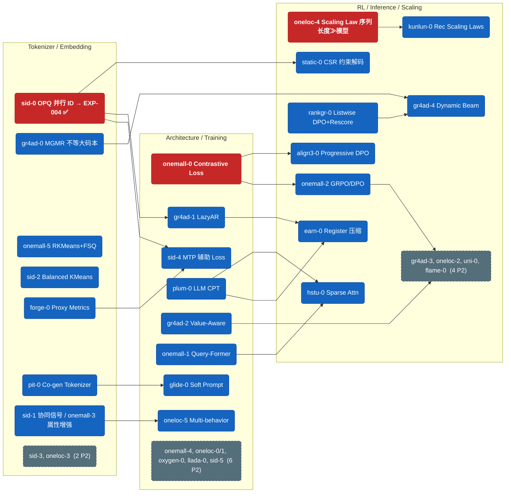

# Ideas

从论文/技术文章中提炼的实验想法，按**改进维度**组织。每个文件对应一个维度，包含该方向所有 idea 的演进关系、实验设计和优先级评估。

想法成熟后迁移到 `experiments/log.md` 作为正式实验。

## 文件索引

| 文件 | 维度 | Ideas 数 | P0 |
|------|------|---------|-----|
| [tokenizer.md](tokenizer.md) | 量化方法 (RQ/OPQ/FSQ/Balanced/Co-gen) | 6 | sid-0 |
| [embedding.md](embedding.md) | 表征增强 (协同/多模态/属性) | 4 | — |
| [architecture.md](architecture.md) | 模型架构 (LazyAR/QFormer/SoftPrompt/Diffusion) | 8 | — |
| [training.md](training.md) | 训练目标 (Contrastive/MTP/Value/LLM-CPT) | 6 | onemall-0 |
| [rl-alignment.md](rl-alignment.md) | RL 对齐 (GRPO/DPO/Progressive/Listwise/SPO) | 6 | — |
| [inference.md](inference.md) | 推理优化 (Dynamic Beam/CSR约束/Register压缩) | 4 | — |
| [scaling.md](scaling.md) | 扩展性 (序列长度/MFU/Sparse Attn) | 3 | oneloc-4 |

**总计: 37 ideas (3 P0 / 24 P1 / 10 P2)**

## 全局演进图

核心依赖链（红 = P0，蓝 = P1，灰虚线 = P2 折叠）。完整 idea 列表见各维度文件。

## ID 来源追溯

| Prefix | 来源 | 论文 |
|--------|------|------|
| `sid` | 知乎综述 3.1 节 + Meta RPG (KDD'25, arxiv 2506.05781) | 语义 ID 构造方法综述 |
| `gr4ad` | GR4AD (arxiv 2602.22732) | 快手大规模广告生成式推荐 |
| `onemall` | OneMall (arxiv 2601.21770v2) | 快手电商端到端生成式推荐 |
| `oneloc` | OneLoc (arxiv 2508.14646v1) | 快手地理感知生成式推荐 |
| `pit` | PIT (arxiv 2602.08530) | 快手动态个性化 Tokenizer |
| `forge` | FORGE (arxiv 2509.20904) | 阿里淘宝 SID 基准 + Proxy Metrics |
| `glide` | GLIDE (arxiv 2603.17540) | Spotify 生成式推荐 (Soft Prompt) |
| `oxygen` | OxygenREC (arxiv 2512.22386) | Fast-Slow Thinking 工业 GR |
| `llada` | LLaDA-Rec (arxiv 2511.06254) | Discrete Diffusion 生成式推荐 |
| `plum` | PLUM (arxiv 2510.07784) | Google/YouTube LLM 推荐 |
| `align3` | Align³GR (arxiv 2511.11255) | 快手三层对齐, AAAI 2026 Oral |
| `rankgr` | RankGR (arxiv 2602.08575) | 阿里淘宝 Listwise DPO |
| `uni` | UniSearch (arxiv 2509.06887) | 快手统一搜索 SPO |
| `static` | STATIC (arxiv 2602.22647) | Google/YouTube CSR 约束解码 |
| `flame` | FLAME (arxiv 2509.22681) | GR 推理系统 |
| `earn` | EARN (arxiv 2507.00715) | Register Token 推理加速, KDD 2025 |
| `kunlun` | Kunlun (arxiv 2602.10016) | Meta Ads Scaling Laws |
| `hstu` | ULTRA-HSTU (arxiv 2602.16986) | Meta Sparse Attention Co-design |

## 全局优先级总览

### P0 — 战略方向 / 立即执行

| ID | 维度 | 实验 | 原因 |
|-----|------|------|------|
| IDEA-sid-0 | Tokenizer | OPQ 并行语义 ID → EXP-004 | ARCHITECTURE.md 核心方向，RPG 完整验证 |
| IDEA-onemall-0 | Training | NTP Contrastive Loss | OneMall 标配，为 RL 建立强基线 |
| IDEA-oneloc-4 | Scaling | 序列长度 vs 模型大小 | 直接决定资源分配策略 |

### P1 — 高价值

| ID | 维度 | 实验 |
|-----|------|------|
| IDEA-gr4ad-0 | Tokenizer | MGMR 不等大码本 (RQ 对比基线) |
| IDEA-onemall-5 | Tokenizer | RKMeans+FSQ (RQ 对比基线) |
| IDEA-sid-1 | Embedding | 协同信号增强 |
| IDEA-sid-2 | Tokenizer | Balanced KMeans |
| IDEA-sid-4 | Training | Token-Space MTP Loss |
| IDEA-pit-0 | Tokenizer | Co-generative 动态 Tokenizer |
| IDEA-forge-0 | Tokenizer | SID Proxy Metrics + Offline Pretraining |
| IDEA-onemall-1 | Architecture | Query-Former 序列压缩 |
| IDEA-onemall-2 | RL | GRPO/DPO 对齐 |
| IDEA-onemall-3 | Embedding | 属性增强 Contrastive |
| IDEA-gr4ad-1 | Architecture | LazyAR 解码器 |
| IDEA-gr4ad-2 | Training | Value-Aware 训练 |
| IDEA-gr4ad-4 | Inference | Dynamic Beam Search |
| IDEA-glide-0 | Architecture | Soft Prompt Injection |
| IDEA-plum-0 | Training | LLM Continued Pre-Training |
| IDEA-align3-0 | RL | Progressive DPO (SP→RF) |
| IDEA-rankgr-0 | RL | Listwise DPO + Rescore |
| IDEA-static-0 | Inference | CSR 约束解码 |
| IDEA-earn-0 | Inference | Register Token 压缩 |
| IDEA-kunlun-0 | Scaling | Rec Scaling Laws (MFU + GDPA) |
| IDEA-hstu-0 | Scaling | Sparse Self-Attention Co-design |
| IDEA-oneloc-2 | RL | DPO + 双目标 |
| IDEA-oneloc-3 | Embedding | Side-info 融合 |
| IDEA-oneloc-5 | Training | Multi-behavior 序列 |

### P2 — 有前置依赖

| ID | 维度 | 实验 |
|-----|------|------|
| IDEA-sid-3 | Embedding | 多模态 ESANS |
| IDEA-sid-5 | Training | Codebook Embed 聚合 |
| IDEA-onemall-4 | Architecture | Loss-Free MoE |
| IDEA-oxygen-0 | Architecture | Fast-Slow Thinking |
| IDEA-llada-0 | Architecture | Discrete Diffusion 解码 |
| IDEA-gr4ad-3 | RL | RSPO 排序优化 |
| IDEA-uni-0 | RL | SPO 搜索偏好优化 |
| IDEA-flame-0 | Inference | GR Serving 系统 |
| IDEA-oneloc-0 | Architecture | Context-augmented Attn |
| IDEA-oneloc-1 | Architecture | Category Prompt |
